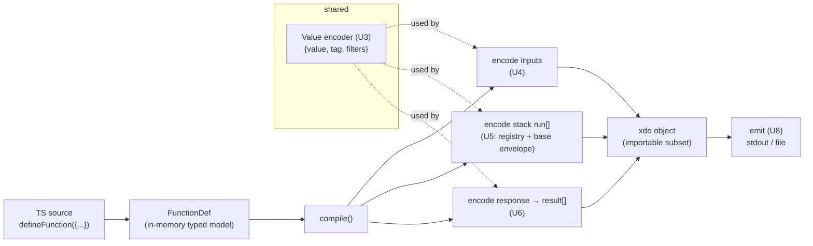
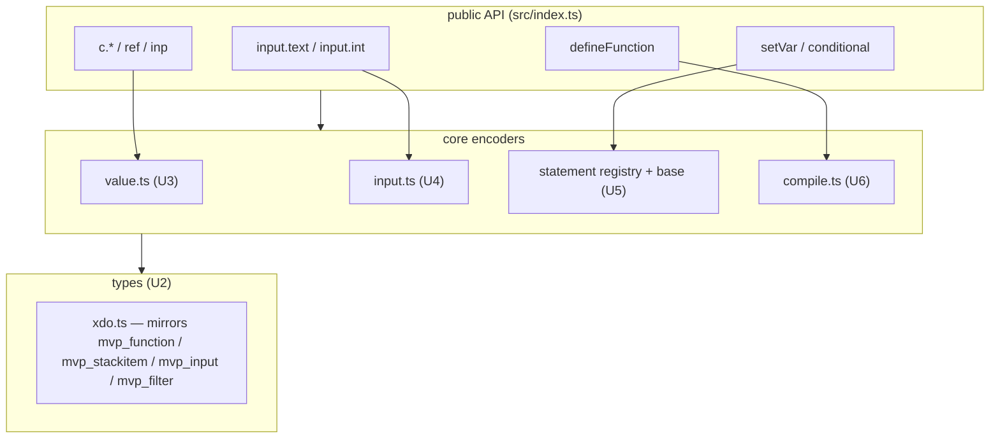

# feat: sidestep — TypeScript → Xano `mvp_function` JSON compiler (MVP)

**Target repo:** `sidestep` (currently empty except `readme.md`). All repo-relative paths below are relative to `~/git/sidestep`.

**Reference repo:** `cloud-client` (the Xano engine/PHP codebase). Referenced for the target JSON contract only; not modified by this plan. Cross-repo references are prefixed `cloud-client:`.

---

## Summary

Build the first slice of **sidestep**: a TypeScript SDK that lets a developer (or, primarily, an AI agent) author a Xano **function** in TypeScript and **compile** it into Xano's stored `mvp_function` `xdo` JSON. The MVP stops at emitting the JSON artifact (stdout or file) — no live-instance push, no auth, no API client.

The MVP proves the whole pipeline end-to-end against a **real golden fixture** pulled from the engine's own test data: typed inputs (`text` with a `trim` method, `int`), a `set_var` statement, and a `var` response. A second statement (`conditional`) is included to prove the statement-registry abstraction generalizes beyond a single special case (nested stacks + expression encoding). The full ~500-statement catalog, API push, and round-trip decompile are explicitly out of scope.

---

## Problem Frame

Xano functions are authored today either in the visual builder or as **XanoScript** text (`.xs`), both of which are converted to a complex stored JSON (`mvp_function.xdo`) by the engine. There is no first-class, type-safe, programmatic way to author functions in a mainstream language. We want a TypeScript framework that compiles down to that same JSON — an **AI-first SDK** where an agent can emit well-typed TS that deterministically produces valid Xano function JSON.

This plan delivers the smallest honest version of that: author one function, compile it to the importable `xdo` subset, emit the artifact, and verify byte-equivalence (after normalization) against a real engine fixture.

**Why raw JSON (not XanoScript text):** Decision confirmed with the user. Targeting JSON directly removes any runtime dependency on the engine's text parser and makes the SDK self-contained and independently testable. The cost — replicating the JSON encoding rules (tagged values, statement envelope, input schema) — is bounded for the MVP statement set and is the central risk this plan manages (see Risks).

---

## Key Technical Decisions

### KTD-1: Compile to the **importable `xdo` subset** as a **flat** object, omitting server/auto-generated fields
**The `xdo` object is flattened into the parent row.** In `cloud-client: extensions/MVP/includes/xano/dbo/mvp/function.yaml`, `inline: xdo` means the `xdo` field's contents are **merged into the parent**, not nested under an `xdo` key. So the persisted/exported JSON is flat — `id`, `created_at`, `updated_at`, `deleted_at?` sit at the **same top level** as the authored fields `name`, `description`, `docs`, `input`, `run`, `result`, `cache`, `history`, `middleware`, … (exactly as the golden fixture shows). **The SDK emits this flat shape with no `xdo: {}` wrapper.**

The engine auto-generates `_xsid` (`f:`/`i:`/`r:`/`function:` prefixed UUIDs), the server columns `id`, `created_at`/`updated_at`/`deleted_at`, `guid`, and runtime-only keys (`@guid`, `@index`, `stack_id`) **on import / at persistence** (`cloud-client: extensions/MVP/includes/xano/helper/mvp/Migrate.php`, `importStatement` sets `_xsid = 'f:'.uuid4()`). The SDK therefore emits only the authored fields and **omits** the server/auto-generated ones. Fidelity is verified by comparing against the golden fixture with those fields stripped (see U6 normalization). Rationale: smaller surface, no UUID generation needed for MVP, and matches how import actually consumes the data.

### KTD-2: Tagged values are first-class `Value` objects encoded as `{value, tag, filters}`
Every place a function references data — statement context, input bindings, response — uses Xano's tagged-value shape (`cloud-client: extensions/MVP/includes/xano/xs/type/mvp/Filter.php` and the golden fixture). The SDK models this as a single `Value` primitive produced by small constructor helpers (`c.int(123)` → `{value:"123", tag:"const:int", filters:[]}`, `ref('x1')` → `{tag:"var", value:"x1"}`). This primitive is reused by inputs, statements, and responses, so it is built and tested once (U3).

### KTD-3: AI-first **declarative factory** authoring API (flat, explicit, 1:1 with JSON)
Confirmed approach freedom from the user ("AI-first SDK, whatever is easiest"). The API is declarative factory functions composed into `defineFunction({...})`, not a fluent builder and not real-TS-transpilation. Rationale: flat/explicit code is the easiest for an LLM to emit correctly and the easiest to compile (data in → JSON out), with no hidden control-flow inference. Transpiling real TS (the "magic" option) is deferred — high ambiguity, wrong risk profile for an MVP.

Authoring shape the MVP targets:
```ts
// directional — see U6 for the authoritative contract
import { defineFunction, input, setVar, conditional, ref, inp, c } from "sidestep";

export default defineFunction({
  name: "omg1",
  input: { name: input.text({ required: false, methods: ["trim"] }) },
  stack: [
    setVar("x1", c.int(123)),
  ],
  response: ref("x1"),               // single value → result:[{name:"", tag:"var", value:"x1"}]
});
```

### KTD-4: Statement **registry** with a base encoder that fills the common envelope
Each `run[]` item shares a fixed envelope (`output:{customize:false,filters:[],items:[]}`, `addon:[]`, `settings_registry:[]`, `description:""`). A base statement encoder fills these so each concrete statement (`setVar`, `conditional`) only declares its `name`, `as`, `context`, and `input[]`. Rationale: this is the extensibility seam — proving two statements through it de-risks the eventual 500-statement catalog without building it now.

### KTD-5: Tooling — TypeScript (strict) + Vitest + tsup/tsc, ESM
Fresh repo, so pick a modern, light, TS-native stack: `vitest` for tests (snapshot + golden-fixture assertions), `tsup` (or plain `tsc`) for build, strict `tsconfig`. (xanomatic uses Jest, but we are not building on it — see Scope Boundaries.) This is a low-stakes default; the implementer may swap test runners if preferred.

### KTD-6: Everything is tested — no behavior ships untested
Comprehensive automated test coverage is a hard requirement of this MVP, not an afterthought. **Every unit that produces or transforms data ships with passing tests in the same commit**, and a unit is not "done" until its tests pass. Concretely: every `Value`/input/statement encoder, the `compile()` assembly, the response mapping, the emit/CLI path, and the normalization helper are all directly tested; the golden-fixture deep-equal (U6) is the spine. The only untested unit is U1 (pure config/scaffold, no behavior) — and even it is verified by a green `typecheck` + `test` run. See the **Testing Philosophy** section for the coverage contract.

---

## Testing Philosophy

**Everything is tested. No unit is complete until its tests pass.** This is the coverage contract for the MVP (KTD-6):

- **Per-unit tests are mandatory.** Each data-producing/transforming unit (U2–U8) ships with its own test file in the same commit. The per-unit `Test scenarios` lists below are the floor, not the ceiling.
- **Test pyramid:**
  - *Unit/encoder tests* — every `c.*` helper, `ref`/`inp`, each input encoder, each statement encoder, the base envelope, the response mapper, and the normalizer assert exact JSON output against expected literals.
  - *Golden / contract test (U6)* — SDK-authored function `compile()` deep-equals the **real vendored engine fixture** after normalization. This is the load-bearing fidelity proof and is extended with a new fixture whenever a statement is added.
  - *Integration tests* — full `defineFunction → compile → emit` round-trips, including a stack with a nested `conditional`, and the CLI writing an artifact to a temp dir.
  - *Type-level tests* — positive and `@ts-expect-error` negative assertions on the `xdo` types (U2), so the compile target is enforced at the type boundary too.
- **Categories covered per unit (where applicable):** happy path, edge cases (empty stack, empty methods, no `else`, numeric stringification, null/obj encoding), and error paths (missing `name`, unknown statement, unsupported operator) — each with named input → expected output.
- **CI gate:** `npm run typecheck && npm run lint && npm test` must be green; the build is not shippable otherwise.
- **No silent gaps:** if a behavior can't be unit-tested in isolation, it is covered by an integration or golden test — nothing relies on manual inspection.

---

## High-Level Technical Design

**Compile pipeline (author → artifact):**



**Layered module architecture:**



The two diagrams are authoritative for module boundaries and data flow; field-level details live in U2/U3.

---

## Output Structure

Greenfield layout this MVP creates (per-unit `Files:` lists remain authoritative):

```
sidestep/
├── package.json
├── tsconfig.json
├── vitest.config.ts
├── .eslintrc.cjs
├── readme.md                      (exists, currently empty → filled in U8)
├── src/
│   ├── index.ts                   public exports (U6/U8)
│   ├── types/
│   │   └── xdo.ts                 stored-JSON type mirror (U2)
│   ├── values/
│   │   └── value.ts               Value model + encoder, c.*, ref, inp (U3)
│   ├── inputs/
│   │   └── input.ts               input.text/int + encoder (U4)
│   ├── statements/
│   │   ├── statement.ts           Statement type + base envelope + registry (U5)
│   │   ├── set-var.ts             setVar (U5)
│   │   └── conditional.ts         conditional (U7)
│   ├── function/
│   │   ├── define.ts              defineFunction + FunctionDef model (U6)
│   │   └── compile.ts             compile() → xdo (U6)
│   └── emit/
│       └── emit.ts                emit to stdout/file + CLI entry (U8)
└── test/
    ├── fixtures/
    │   └── golden-set-var-function.json   vendored real fixture (U6)
    └── *.test.ts                  co-located/grouped unit + golden tests
```

---

## Implementation Units

### U1. Project scaffold & tooling
**Goal:** A buildable, testable, strict-TS package skeleton in the empty `sidestep` repo.
**Requirements:** Foundation for all units.
**Dependencies:** none.
**Files:** `package.json`, `tsconfig.json`, `vitest.config.ts`, `.eslintrc.cjs`, `.gitignore`, `src/index.ts` (placeholder export).
**Approach:** Init `git` if not already a repo. Package `name: "sidestep"`, ESM (`"type": "module"`), `strict: true`, `target` ES2022. Scripts: `build`, `test`, `lint`, `typecheck`. Add `vitest`, `typescript`, `tsup` (or rely on `tsc`), `eslint` + TS plugin as devDeps. No runtime dependencies (keep the SDK dependency-free for the MVP).
**Patterns to follow:** Mirror the modern tooling shape from `cloud-client: package` conventions where sensible; do **not** copy xanomatic's Jest setup.
**Test scenarios:**
- `Test expectation: none -- scaffolding/config only.` Verification is that `npm run typecheck` and an empty `vitest` run both succeed.
**Verification:** `npm install && npm run typecheck && npm test` exits clean with zero tests or one placeholder test.

---

### U2. Core `xdo` type definitions
**Goal:** TypeScript types that mirror the stored JSON contract so the rest of the SDK is type-checked against the real shape.
**Requirements:** Type-safe compile target; underpins U3–U8.
**Dependencies:** U1.
**Files:** `src/types/xdo.ts`, `test/types-xdo.test.ts` (compile-time/type-level assertions).
**Approach:** Define TS interfaces mirroring (all fields **flat** at the top level per KTD-1 — no `xdo` wrapper):
- `FunctionXdo` (the flattened authored envelope): `name`, `description`, `docs`, `workspace:{id}`, `branch:{id}`, `cache`, `history`, `middleware:{pre,post,pre_customize,post_customize}`, `tag[]`, `input: InputXdo[]`, `run: StackItemXdo[]`, `result: ResultItemXdo[]`, `test[]`. Keep server columns (`id`, `created_at`, `updated_at`, `deleted_at`, `guid`) in a separate `PersistedFunctionRow = FunctionXdo & {…server fields}` type used **only** by the test normalizer — the SDK never emits them.
- `StackItemXdo`: `{ name, as, context, description, disabled?, input: InputRouteXdo[], output:{customize,filters,items}, addon[], settings_registry[] }` (per `cloud-client: extensions/MVP/includes/xano/xs/type/mvp/StackItem.php`).
- `InputXdo`, `InputRouteXdo`, `FilterXdo` (`{name, disabled, arg: TaggedArg[]}`), `TaggedValue` (`{value, tag, filters}`), `Tag` enum (`const`, `const:int`, `const:decimal`, `const:bool`, `const:array`, `const:obj`, `const:null`, `const:expr`, `var`, `input`, `auth`, `env`, `setting`, `col`, `output`, `response`, `trycatch`, `toolset`).
**Patterns to follow:** `cloud-client: extensions/MVP/includes/xano/dbo/mvp/function.yaml`; `xs/type/mvp/StackItem.php`, `Input.php`, `Filter.php`, `Tag.php`. Borrow naming from xanomatic's `src/xanomatic/xanoscript_json_schema/FunctionXs.ts` where aligned (reference only).
**Test scenarios:**
- Type-level: a hand-written object literal matching the golden fixture's `run[0]` (set_var) assigns to `StackItemXdo` without error (use `expectTypeOf` or a `// @ts-expect-error`-guarded negative case).
- Negative: a stack item missing `name` fails to type-check (`@ts-expect-error`).
**Verification:** `npm run typecheck` passes; type tests assert both positive and negative cases.

---

### U3. Tagged-value model & encoder (the shared `Value` primitive)
**Goal:** One reusable `Value` abstraction + constructor helpers, encoded to `{value, tag, filters}`.
**Requirements:** Reused by inputs (U4), statements (U5), response (U6) — KTD-2.
**Dependencies:** U2.
**Files:** `src/values/value.ts`, `test/value.test.ts`.
**Approach:** Define a `Value` (either a tagged-value object or a thin branded wrapper). Provide helpers:
- `c.text(s)` → `{value:s, tag:"const", filters:[]}`
- `c.int(n)` → `{value:String(n), tag:"const:int"}` (note: values serialize as **strings**, per fixture `"123"`)
- `c.decimal(n)`, `c.bool(b)` → `"true"/"false"` with `const:bool`, `c.null()` → `const:null`, `c.obj(o)`/`c.array(a)` → JSON-string value with `const:obj`/`const:array`.
- `ref(name)` → `{tag:"var", value:name}` (variable reference).
- `inp(name)` → `{tag:"input", value:name}` (input reference).
- `withFilters(value, FilterXdo[])` and a minimal `filter(name, ...args)` builder to attach the `mvp_filter` chain (`{name, disabled:false, arg:[...]}`).
**Patterns to follow:** Golden fixture tagged values; `cloud-client: Filter.php`; xanomatic `src/utils/filters.ts`, `pipes.ts` (reference for filter names).
**Test scenarios:**
- Happy path: each `c.*` helper produces the exact `{value, tag, filters}` object (assert against literals; numbers stringify — `c.int(123).value === "123"`).
- `ref("x1")` and `inp("name")` produce the correct tag/value.
- Edge: `c.null()` emits `value` consistent with fixture convention; `c.obj({q:"abc"})` round-trips to a parseable JSON string with `tag:"const:obj"`.
- Filters: `withFilters(c.obj({}), [filter("set", c.text("q"), c.text("abc"))])` matches the nested `arg` shape from the research example.
**Verification:** `npm test` green; encoder output matches expected literals.

---

### U4. Input authoring & encoder
**Goal:** Author typed function inputs and encode them to `InputXdo[]`.
**Requirements:** Inputs of the golden fixture (`name: text|trim`, `score: int`).
**Dependencies:** U2, U3.
**Files:** `src/inputs/input.ts`, `test/input.test.ts`.
**Approach:** `input.text(opts?)` / `input.int(opts?)` returning an internal input descriptor; `opts` supports `required`, `nullable`, `default`, `description`, and `methods` (e.g. `["trim"]` → `methods:[{name:"trim",disabled:false,arg:[]}]`). An `encodeInput(name, descriptor)` fills the full `InputXdo` with engine defaults from the fixture (`merge:false`, `hidden:[]`, `override:[]`, `customize:""`, `values:[]`, `mode:""`, `format:""`, `sensitive:false`, `list:{min:"",max:""}`, `vector:{size:3}`, `access:"public"`, `style:{type:"single"}`, `children:[]`, `market_item:{id:"",version:"",guid:""}`, `is_settings_registry:false`), **omitting `_xsid`** (KTD-1).
**Patterns to follow:** Golden fixture `input[]` entries; `cloud-client: Input.php`.
**Test scenarios:**
- Happy: `input.text({methods:["trim"]})` named `name` encodes to the fixture's `name` input entry exactly (minus `_xsid`).
- Happy: `input.int()` named `score` encodes to the fixture's `score` entry (minus `_xsid`).
- Edge: `required:true` / `nullable:true` / `default` flow into the right fields; default value stored as string.
- Edge: empty `methods` yields `methods:[]`.
**Verification:** Encoded inputs deep-equal the fixture entries after stripping `_xsid`.

---

### U5. Statement registry + base envelope + `setVar`
**Goal:** The extensibility seam (KTD-4) plus the first concrete statement.
**Requirements:** `set_var` statement of the golden fixture.
**Dependencies:** U2, U3.
**Files:** `src/statements/statement.ts`, `src/statements/set-var.ts`, `test/set-var.test.ts`.
**Approach:** Define a `Statement` shape that each factory returns (carrying `name`, optional `as`, `context`, `input[]`). `encodeStatement(stmt)` wraps it with the common envelope defaults (`output:{customize:false,filters:[],items:[]}`, `addon:[]`, `settings_registry:[]`, `description:""`) and omits `_xsid`. A tiny registry maps statement name → encoder (trivial for MVP, but established now so U7 plugs in cleanly). `setVar(as, value)` → `{ name:"mvp:set_var", as, context:{ value: value.value, tag: value.tag, filters: value.filters } }` (set_var carries its value in `context`, not `input[]` — special-case confirmed by fixture).
**Patterns to follow:** Golden fixture `run[0]`; `cloud-client: xs/statement/mvp/SetVar.php`.
**Test scenarios:**
- Happy: `setVar("x1", c.int(123))` encodes byte-equal to the fixture's `run[0]` (minus `_xsid`).
- Edge: `setVar` with a `var`/`input` value (`ref`/`inp`) places the correct tag in `context`.
- Envelope: encoded statement always includes the empty `output`/`addon`/`settings_registry` scaffolds.
- Registry: looking up `"mvp:set_var"` resolves the encoder; unknown name throws a clear error.
**Verification:** `setVar` output deep-equals fixture `run[0]` after `_xsid` strip; registry lookups behave.

---

### U6. `defineFunction` + response + `compile()` (integration seam, golden-fixture validated)
**Goal:** Assemble inputs + stack + response into the importable `xdo` and validate against the real fixture.
**Requirements:** End-to-end MVP; full fixture parity.
**Dependencies:** U2, U3, U4, U5.
**Files:** `src/function/define.ts`, `src/function/compile.ts`, `src/index.ts` (export surface), `test/fixtures/golden-set-var-function.json` (vendored copy of `cloud-client: extensions/MVP/includes/xano/test/script/data/transform-temp/schema:function.json`), `test/compile.golden.test.ts`.
**Approach:**
- `defineFunction(def)` validates and stores a typed `FunctionDef` (name required; `input` record; `stack` array; `response`).
- `response` accepts a single `Value` (→ `result:[{name:"", tag, value, filters:[]}]`) or a `Record<string, Value>` (→ one result item per key with `name` set).
- `compile(fn)` produces `FunctionXdo`: maps inputs (U4), stack (U5), response, and fills envelope defaults (`cache:{active:false,ttl:3600,input:true,auth:true,datasource:true,ip:false,headers:[],env:[]}`, `history:{inherit:true,enabled:false,limit:100}`, `middleware:{pre:[],post:[],pre_customize:false,post_customize:false}`, `tag:[]`, `docs:""`, `branch:{id:0}`). `workspace.id` defaults to `0` (emit-only; deploy-target binding deferred).
- **Normalization helper** (shared by the golden test): strips server/auto-generated keys (`id`, `created_at`, `updated_at`, `guid`, `_draft`, `_xsid`, `@guid`, `@index`, `stack_id`, top-level `function:` id, `settings_registry` top-level if absent in author intent, `market_item`) from both sides before deep-equal.
**Patterns to follow:** Golden fixture top-level shape; `cloud-client: dbo/mvp/function.yaml` defaults; `helper/MVP.php` `convertFunctionToConfig` (reference for field set).
**Test scenarios:**
- **Golden (Covers the MVP acceptance):** authoring the fixture's function in the SDK (`name`/`score` inputs minus the unused `score`, the `set_var x1=123`, response `var x1`) and `compile()` deep-equals the vendored fixture after normalization.
- Happy: single-`Value` response produces a one-item `result` with `name:""`.
- Happy: record response (`{data: ref("x1"), status: c.text("ok")}`) produces two named result items.
- Edge: empty `stack` compiles to `run:[]` with valid envelope; missing `name` throws.
- Edge: envelope defaults present and correct when omitted by author.
- Error: a stack entry that isn't a known statement throws a descriptive error (via U5 registry).
**Verification:** Golden test passes (the load-bearing proof); `npm test` green; `compile()` output validates against U2 types.

---

### U7. `conditional` statement (control flow — proves registry generalizes)
**Goal:** A second, structurally different statement: nested `run[]` stacks + a minimal expression, proving the registry/base seam isn't a `set_var` special case.
**Requirements:** Extensibility proof; minimal control flow.
**Dependencies:** U5, U6.
**Files:** `src/statements/conditional.ts`, `test/conditional.test.ts`.
**Approach:** `conditional({ when, then, else? })` where `when` is a **minimal** single binary comparison (`expr(left, op, right)` with `op ∈ {"=","!=",">","<",">=","<="}`), and `then`/`else` are statement arrays compiled through the same `encodeStatement` path (nested `context.if.run` / `context.else.run`). Encode `context.expr.expression` per the research example shape (single `type:"statement"` entry with `left`/`right` tagged operands). Reuse U3 `Value` for operands.
**Patterns to follow:** Research example of stored `mvp:conditional`; `cloud-client: xs/statement/mvp/Conditional.php`.
**Test scenarios:**
- Happy: `conditional({ when: expr(inp("score"), ">", c.int(10)), then:[setVar("x1", c.int(1))], else:[setVar("x1", c.int(2))] })` encodes to the expected nested-run JSON (assert structure of `context.expr`, `context.if.run`, `context.else.run`).
- Edge: no `else` omits/empties the else branch consistently with the engine shape.
- Integration: a `defineFunction` whose stack contains a `conditional` compiles and validates against U2 types (nested statements carry the full envelope).
- Edge: unsupported `op` throws a clear error.
**Verification:** Encoded conditional matches expected structure; nested statements pass through the base envelope encoder; full-function compile with a conditional type-checks.

---

### U8. Emit entrypoint + README
**Goal:** Produce the artifact (the MVP's terminal output) and document usage.
**Requirements:** "Emit artifact only" boundary.
**Dependencies:** U6.
**Files:** `src/emit/emit.ts`, `src/index.ts` (re-export emit + a `bin` entry), `package.json` (`bin` field), `readme.md` (fill the empty file).
**Approach:** `emit(fn, opts?)` → pretty-printed JSON string of `compile(fn)`; `writeArtifact(fn, path)` writes it to disk. A minimal CLI (`sidestep compile <file.ts> [--out <path>]`) that imports a module's default-exported `FunctionDef`, compiles, and writes to stdout or `--out`. Keep the CLI thin (dynamic import + emit); heavier ergonomics deferred. README: install, the `defineFunction` example from KTD-3, and `compile`/`emit` usage.
**Patterns to follow:** `cloud-client: cli` script shape (reference); standard Node `bin` conventions.
**Test scenarios:**
- Happy: `emit(fn)` returns valid JSON that `JSON.parse` round-trips and deep-equals `compile(fn)`.
- Happy: `writeArtifact` writes the file; contents parse and match.
- CLI (integration): compiling the example function module via the CLI writes the expected JSON to `--out` (use a temp dir).
- Edge: emitting a function with an empty stack still produces valid JSON.
**Verification:** `npm test` green; running the CLI against the example produces the golden-equivalent JSON; README renders the working example.

---

## Scope Boundaries

**In scope (MVP):**
- Authoring one function: typed `text`/`int` inputs (with `methods` like `trim`), a stack of `setVar` and `conditional`, and a `var`/named response.
- Compiling to the importable `xdo` JSON subset and emitting it (stdout/file/CLI).
- Full parity with one real golden fixture.

### Deferred to Follow-Up Work
- The remaining ~500 statement types (`dbo_*`, `api_request`, `function_call`, loops, try/catch, arrays/strings, external services, etc.) — the registry (U5) is the seam they plug into.
- Richer `conditional` expressions (boolean groups, `or`, nested groups) beyond a single comparison.
- Pushing/deploying to a live Xano instance via the metadata API (auth, API client, workspace/branch binding) — would build on `emit` and the xanomatic API patterns.
- Round-trip / decompile (existing `xdo` JSON → TS).
- APIs, tasks, triggers, tables/schemas (other top-level Xano objects beyond functions).
- `_xsid`/guid generation and draft/version semantics.

### Out of scope (not this product's job)
- Reimplementing or wrapping the engine's XanoScript text parser.
- Executing functions / runtime behavior — sidestep only compiles, the engine executes.

---

## Risks & Dependencies

| Risk | Impact | Mitigation |
|---|---|---|
| **JSON fidelity drift** — emitted `xdo` subtly differs from what import accepts | High — invalid functions | Golden-fixture deep-equal test (U6) against real engine test data; vendored fixture; normalization strips only auto-generated fields. Add more fixtures as statements grow. |
| **Hidden required fields** discovered only at import time | Medium | MVP is emit-only, so import isn't exercised; document `xdo` subset assumption; treat first real import attempt (a follow-up) as a verification milestone. |
| **`set_var` context vs `input[]` placement** varies by statement | Medium | Confirmed per-statement from fixture/PHP; the registry (U5) localizes each statement's quirks; conditional (U7) deliberately exercises a different shape. |
| **Tagged-value stringification** (numbers stored as strings, JSON-encoded objs) | Medium | Centralized in U3 `Value` encoder with explicit tests asserting `"123"` etc. |
| Golden fixture path in `cloud-client` is test/temp data and could move | Low | Vendor a copy into `test/fixtures/` (U6) so the SDK test is self-contained. |

**External dependency:** the `cloud-client` repo is the source of truth for the JSON contract. This plan only reads it; if the contract changes, fixtures and U2 types must be refreshed.

---

## Verification Strategy (MVP done = )

1. `npm run typecheck && npm run lint && npm test` all green.
2. The **golden test (U6)** passes: SDK-authored function `compile()` deep-equals the vendored real fixture after normalization.
3. A function containing a `conditional` compiles and type-checks (U7).
4. The CLI emits valid JSON for the documented example (U8).

---

## Sources & Research

- `cloud-client: extensions/MVP/includes/xano/dbo/mvp/function.yaml` — `mvp_function` envelope schema + defaults.
- `cloud-client: extensions/MVP/includes/xano/xs/type/mvp/StackItem.php` / `Input.php` / `Filter.php` / `Tag.php` — stored fragment schemas.
- `cloud-client: extensions/MVP/includes/xano/test/script/data/transform-temp/schema:function.json` — **golden fixture** (vendored in U6).
- `cloud-client: extensions/MVP/includes/xano/helper/mvp/Migrate.php` — `_xsid` auto-generation on import (KTD-1).
- `cloud-client: extensions/MVP/includes/xano/helper/MVP.php` — `convertFunctionToConfig` etc. (field reference).
- `cloud-client: extensions/MVP/includes/xano/xs/statement/mvp/SetVar.php`, `Conditional.php` — statement semantics.
- `cloud-client: scripts/data/function/add.xs` — XanoScript text form (context; not the target).
- `xanomatic: src/xanomatic/xanoscript_json_schema/FunctionXs.ts`, `src/utils/{statements,filters,pipes}.ts` — prior-art TS reference (not a build base).
