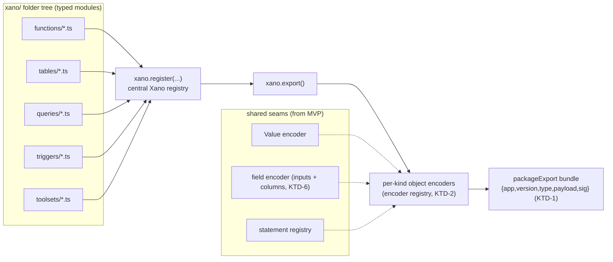
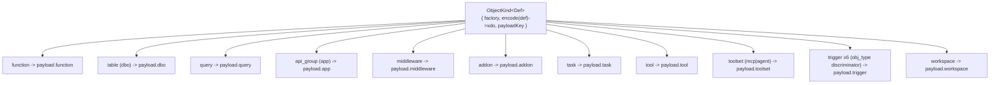
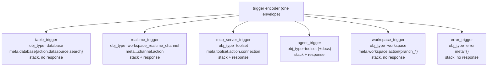

# feat: sidestep — full Xano workspace SDK (all object kinds + statement catalog, 1:1)

**Target repo:** `sidestep`. All repo-relative paths below are relative to `~/git/sidestep`.

**Reference repo:** `cloud-client` (the Xano engine/PHP codebase). Read-only source of truth for the JSON contract and golden fixtures. Cross-repo references are prefixed `cloud-client:`.

**Continues:** `docs/plans/2026-06-24-001-feat-sidestep-function-compiler-plan.md` (the shipped function-compiler MVP). This plan generalizes that MVP from one object kind into the full workspace.

---

## Summary

Grow sidestep from a single-object (`function`) emit-only compiler into a **comprehensive, project-structured, 1:1 TypeScript SDK** for authoring an entire Xano workspace. Developers (primarily AI agents) lay out a `xano/` folder tree where each module exports typed objects, register them on a central `Xano()` instance, and call `xano.export()` to produce one **importable aggregate bundle** matching the engine's real `packageExport` format. Every top-level object kind and the full ~214-statement catalog are supported with complete field fidelity, proven by deep-equal against the cloud-client golden-fixture corpus.

---

## Problem Frame

The MVP proved the core pipeline (typed authoring → `compile()` → importable `xdo` JSON → emit) against one object kind and two statements. But a real Xano workspace is many object kinds — functions, queries (APIs), tables, triggers, toolsets, tasks, middleware, addons — wired together, plus a ~214-statement instruction catalog. An AI agent building a Xano backend needs to author **all** of it in type-safe TypeScript and emit a single artifact the engine can import.

Two gaps block that today:
1. **Architecture** — `compile()` is hard-coded to the function envelope; there is no multi-kind object model, no workspace aggregation, and no aggregate output format.
2. **Coverage** — only `set_var` and `conditional` exist; the other ~212 statements and every non-function kind are unimplemented.

This plan closes both: a kind-agnostic object model + central `Xano` registry + aggregate `export()`, then full kind and statement coverage, with the engine's own fixture corpus wired as the conformance proof so "1:1" is **measured, not asserted**.

---

## Key Technical Decisions

### KTD-1: Target the engine's real `packageExport` bundle as the aggregate output
`export()` emits the importable shape produced by `cloud-client: extensions/MVP/includes/xano/helper/mvp/Migrate.php::packageExport()`:
```jsonc
{
  "app": "xano",
  "version": "1.03",
  "type": "workspace",          // workspace | schema | content | share
  "payload": {
    "partial": false,
    "workspace": { /* settings */ },
    "dbo": [ /* tables */ ],
    "function": [ /* functions */ ],
    "query": [ /* APIs */ ],
    "app": [ /* api_groups */ ],
    "middleware": [ ], "addon": [ ], "task": [ ], "trigger": [ ],
    "tool": [ ], "toolset": [ ], "workflow_test": [ ], "env": [ ], "branch": [ ]
  },
  "sig": "<base64 sha1>"
}
```
**Rationale:** targeting a real, importable contract preserves the golden-fixture fidelity discipline at the bundle level, not just per-object. The payload keys are the engine's singular names (`function`, `dbo`, `query`, `app`, `trigger`, `toolset`, `tool`). The authoring API may expose friendlier names (`tables`, `apis`) that map onto these keys, but the **emitted keys match the engine**. The `sig` field and exact `version`/`type` semantics are an implementation-time unknown (see Deferred to Implementation).

### KTD-2: One kind-agnostic object model; `function` is just the first registered kind
Introduce an `ObjectKind` abstraction: each kind declares its authoring factory, its envelope encoder, and the payload key it lands under. A per-kind **encoder registry** (mirroring the existing statement registry, U5 of the MVP) is the extensibility seam. The existing function path is refactored onto it with **no behavior change** — the MVP golden test must still pass. **Rationale:** all kinds share `inline: xdo` flattening and the tagged-value/statement seams; modeling them uniformly avoids 13 bespoke compilers and makes the seam the thing we test.

### KTD-3: Hybrid build strategy — fixture-driven kinds, codegen'd declarative statements, hand-handled specials
Resolves the central codegen-vs-hand-author fork with measured data (all counts from `cloud-client: extensions/MVP/includes/xano/script/kind/schema/`):
- **24 object kinds** — every `core/*.yaml` uses `transform: !class` (PHP). Their authoring→JSON mapping is **not** machine-derivable from the schema, so object encoders are **hand-authored**, validated against `dbo/*.yaml` envelopes + golden fixtures.
- **175 of 214 statements** — declarative `transform:` blocks. A **schema-DSL interpreter + codegen** generates their TS factories and encoders from `statement/*.yaml`.
- **38 of 214 statements** — `transform: !class` (conditional, for, group, db.* CRUD, call-statements, etc.). **Hand-authored** encoders, validated against per-statement fixtures.

**Rationale:** hand-authoring 214 statements is unmaintainable and drifts as the engine evolves; pure codegen is impossible because the PHP transforms encode non-derivable mapping logic. The hybrid puts codegen where it pays (the declarative majority) and human attention where the engine demands it.

### KTD-4: The golden-fixture corpus is the conformance suite — coverage is measured
cloud-client ships a fixture per statement and per kind (under `test/script/data/transform-temp/`, `parser/script2json/`, and `process/`). The plan vendors and wires the **entire relevant corpus** as a data-driven conformance test: for each fixture, author-or-load → `compile`/`encode` → normalize → deep-equal. A coverage report lists which kinds/statements are conformant vs. pending, so "1:1" is a number, not a claim. **Rationale:** with full-catalog scope, per-unit assertions can't prove completeness; the corpus can.

### KTD-5: Central `Xano` registry with explicit registration (no folder auto-discovery magic)
Authoring is a `xano/` folder tree, but registration is **explicit** (`xano.register(...)` / `xano.registerFunctions([...])`) — confirmed with the user ("registration model seems easier to not have some magic go wrong"). Folder-convention auto-discovery is explicitly deferred. **Rationale:** explicit registration is deterministic, statically analyzable, and trivially testable; convention-scanning is a thin loader that can be layered later without changing the core.

### KTD-6: Shared field encoder serves both function inputs and table columns
The MVP's `InputXdo` encoder and a table's `schema[]` column entries are nearly identical shapes (`name, type, nullable, default, required, methods[], style, vector, …`). Generalize the input encoder into a shared **field encoder** reused by inputs and columns. **Rationale:** the fixtures show the shapes converge; one tested encoder beats two drifting ones (extends MVP U4).

### KTD-7: Phased delivery; "done" = the conformance suite is green across the vendored corpus
Full-catalog 1:1 is large. Deliver in three phases (foundation → kinds → statements), each landing conformance tests in the same commit (the MVP's testing philosophy, carried forward). The plan is complete when the conformance suite passes across the vendored corpus and the coverage report shows no regressions.

---

## High-Level Technical Design

**Authoring → aggregate bundle pipeline:**



**Object-kind model (KTD-2) and where each kind lands in the payload:**



**The 6 triggers share one envelope (`mvp_trigger`), discriminated by `obj_type` + `meta`:**



These diagrams are authoritative for module boundaries and data flow; field-level details live in the per-unit sections and the vendored fixtures.

---

## Output Structure

New/changed layout this plan creates (per-unit `Files:` lists remain authoritative):

```
sidestep/
├── src/
│   ├── index.ts                      expanded public API
│   ├── workspace/
│   │   ├── xano.ts                   Xano registry class + register* methods (U2)
│   │   └── export.ts                 packageExport bundle assembly + export() (U2)
│   ├── kinds/
│   │   ├── kind.ts                   ObjectKind abstraction + encoder registry (U1)
│   │   ├── function.ts               function kind (refactor of MVP compile) (U1)
│   │   ├── trigger.ts                all 6 triggers (obj_type discriminator) (U4)
│   │   ├── toolset.ts                toolset/agent/mcp_server (U5)
│   │   ├── tool.ts                   tool (U5)
│   │   ├── table.ts                  table/dbo (U6)
│   │   ├── query.ts                  query/API (U7)
│   │   ├── api-group.ts              api_group/app (U7)
│   │   ├── addon.ts                  addon (U8)
│   │   ├── task.ts                   task (U8)
│   │   ├── middleware.ts             middleware (U8)
│   │   └── workspace-config.ts       workspace settings object (U8)
│   ├── fields/
│   │   └── field.ts                  shared field encoder (inputs + columns) (U3)
│   ├── statements/
│   │   ├── schema-dsl/               DSL interpreter + codegen (U9)
│   │   │   ├── parse.ts
│   │   │   ├── interpret.ts
│   │   │   └── generate.ts
│   │   ├── generated/                codegen output (175 declarative) (U9)
│   │   └── special/                  hand-authored 38 !class statements (U10)
│   ├── values/value.ts               (existing)
│   ├── inputs/input.ts               (existing → re-homed on field.ts) (U3)
│   └── emit/
│       ├── emit.ts                   (existing) + bundle emit (U12)
│       └── cli.ts                    `sidestep export` (U12)
├── test/
│   ├── fixtures/                     vendored cloud-client corpus (per unit)
│   ├── conformance/                  data-driven corpus suite + coverage report (U11)
│   └── *.test.ts
└── xano/                             example authored workspace (U12, docs)
```

---

## Implementation Units

Phased per KTD-7. **Phase A** (U1–U3) is the foundation; **Phase B** (U4–U8) adds object kinds; **Phase C** (U9–U11) adds the statement catalog; **U12** is the authoring/CLI surface. Within a phase, units after the first may proceed in parallel where `Files:` don't overlap.

---

### U1. Kind-agnostic object model + encoder registry; refactor `function` onto it
**Goal:** Replace the function-specific `compile()` with an `ObjectKind` abstraction and a per-kind encoder registry; re-express the existing function as the first registered kind with zero behavior change.
**Requirements:** Foundation for all kinds (KTD-2). Preserves MVP fidelity.
**Dependencies:** none (builds on shipped MVP).
**Files:** `src/kinds/kind.ts`, `src/kinds/function.ts`, `src/function/compile.ts` (becomes a thin re-export/adapter), `src/index.ts`, `test/kinds/kind.test.ts`, `test/kinds/function.test.ts`.
**Approach:** Define `ObjectKind<Def, Xdo>` = `{ name, payloadKey, encode(def): Xdo }`. A module-level `kindRegistry` maps kind name → encoder (mirrors `statement.ts` registry). Move the function envelope encoding from `compile.ts` into `kinds/function.ts` registered under payload key `function`. Keep `compile(fn)` working as a façade over the function kind so the MVP golden test is untouched.
**Patterns to follow:** the statement registry in `src/statements/statement.ts`; existing `src/function/compile.ts`.
**Test scenarios:**
- Happy: registering a kind and encoding a def routes through the registry to the right encoder.
- Happy: the existing function golden test (`test/compile.golden.test.ts`) still passes against the function kind (no behavior change).
- Edge: encoding an unregistered kind throws a descriptive error (mirrors statement-registry behavior).
- Integration: two kinds registered; each encodes independently and lands under its declared `payloadKey`.
**Verification:** MVP golden test green; new registry tests green; `typecheck` + `lint` clean.

---

### U2. `Xano` central registry + `export()` aggregate bundle + conformance harness
**Goal:** A `Xano` class that collects registered objects and emits the real `packageExport` bundle (KTD-1); plus the reusable fixture-loading conformance harness (KTD-4).
**Requirements:** The user's `new Xano(); register…; export()` model; importable aggregate output.
**Dependencies:** U1.
**Files:** `src/workspace/xano.ts`, `src/workspace/export.ts`, `test/workspace/export.test.ts`, `test/conformance/harness.ts`, `test/fixtures/bundle/` (vendored aggregate fixture if one exists — see Deferred).
**Approach:** `Xano` holds typed collections keyed by kind; `register(kind, def)` and per-kind sugar (`registerFunctions([...])`, `registerTables([...])`, …) append. `export()` walks the kind registry, encodes each registered def, and assembles `{ app, version, type, payload:{…}, sig }` with the engine's singular payload keys. Build the **conformance harness** here: a helper that reads a vendored fixture JSON, runs the matching encoder, normalizes (extend the MVP `test/helpers/normalize.ts`), and deep-equals — so every later unit plugs into one harness.
**Patterns to follow:** `cloud-client: helper/mvp/Migrate.php::packageExport()` / `partialExport()` for payload ordering and keys; MVP `test/helpers/normalize.ts`.
**Test scenarios:**
- Happy: a `Xano` with one function + one table exports a bundle with those objects under `payload.function` / `payload.dbo`, correct `app`/`version`/`type`.
- Happy: empty workspace exports a well-formed bundle with empty payload arrays.
- Edge: registering the same object twice is rejected or de-duped (decide + test the chosen behavior).
- Edge: payload keys use engine singular names (`function`, `dbo`), not friendly aliases.
- Integration: round-trip `export()` output through `JSON.parse` and assert structural validity against the `packageExport` shape.
- `Test expectation` for `sig`: assert the field is present and matches whatever signing rule U2 adopts (see Deferred to Implementation); if signing is deferred, assert the documented placeholder and mark the gap.
**Verification:** Export tests green; harness usable by a sample fixture; `typecheck` + `lint` clean.

---

### U3. Shared field encoder (function inputs + table columns)
**Goal:** Generalize the MVP input encoder into a shared field encoder reused by inputs and table `schema[]` columns (KTD-6).
**Requirements:** Reuse across U6 (tables) and existing function inputs.
**Dependencies:** U1.
**Files:** `src/fields/field.ts`, `src/inputs/input.ts` (re-home onto `field.ts`), `test/fields/field.test.ts`.
**Approach:** Extract the full `InputXdo` field-default machinery from `src/inputs/input.ts` into `fields/field.ts` parameterized by the field-bearing context (input vs. column). Inputs keep their public `input.text/int` API; columns (U6) call the same encoder with column-specific extras (e.g. index participation handled in U6). Confirm against fixtures that input and column field entries share the default set.
**Patterns to follow:** MVP `src/inputs/input.ts`; `cloud-client: dbo/mvp/dbo.yaml` `schema[]` vs `cloud-client: xs/type/mvp/Input.php`.
**Test scenarios:**
- Happy: existing function-input encodings are unchanged (MVP input tests still pass).
- Happy: a table column (`email` with `trim`+`lower` methods) encodes to the fixture column shape from `cloud-client: …/transform-temp/schema:table.json`.
- Edge: complex/object field with `children[]`, list `{min,max}`, `vector{size}` encodes correctly.
- Edge: enum field carries `values[]`.
**Verification:** MVP input tests green; column encodings deep-equal fixture columns; `typecheck` + `lint` clean.

---

### U4. Triggers — all 6 types through one envelope
**Goal:** One trigger encoder discriminated by `obj_type` + per-type `meta`, covering table/realtime/mcp_server/agent/workspace/error triggers.
**Requirements:** All 6 trigger types named by the user.
**Dependencies:** U1, U2, U3.
**Files:** `src/kinds/trigger.ts`, `test/kinds/trigger.test.ts`, `test/fixtures/triggers/` (vendored).
**Approach:** A `trigger.*` factory family (`trigger.table`, `trigger.realtime`, `trigger.mcpServer`, `trigger.agent`, `trigger.workspace`, `trigger.error`) producing a common trigger def. One encoder fills the shared `mvp_trigger` envelope and sets `obj_type` + the per-type `meta` block; `run[]` reuses the statement registry, `result[]` reuses the response mapper (only for the response-bearing types). Vendor the 6 fixtures (paths from research): `cloud-client: …/parser/script2json/minimal/{db-trigger-1,realtime-trigger,mcp_server-trigger,agent-trigger}.json`, `…/process/schema:workspace_trigger/minimal/DEV-3347.json`, `…/process/schema:error_trigger/minimal/basic.json`.
**Patterns to follow:** `cloud-client: dbo/mvp/trigger.yaml`; `core/{table,realtime,mcp_server,agent,workspace,error}_trigger.yaml`; MVP statement/response encoders.
**Test scenarios:**
- Happy (Covers conformance): each of the 6 trigger types encodes to its vendored fixture after normalization.
- Edge: response-bearing types (realtime, mcp_server, agent) emit `result[]`; config-only types (table, workspace, error) do not.
- Edge: `meta` differs correctly per type (database action/datasource/search; realtime channel.action; toolset.action.connection; workspace branch_* actions; error empty meta).
- Error: an unsupported trigger sub-type or missing required field (e.g. table_trigger without a table) throws.
- Integration: a trigger with a multi-statement stack (incl. a conditional) encodes nested `run[]` correctly.
**Verification:** 6 trigger fixtures conformant via the harness; `typecheck` + `lint` clean.

---

### U5. Toolset family — toolset (mcp|agent), tool, agent, mcp_server
**Goal:** Author and encode the toolset family, modeling the AI-vs-MCP distinction.
**Requirements:** Toolset family named by the user; AI vs MCP clarified.
**Dependencies:** U1, U2, U3.
**Files:** `src/kinds/toolset.ts`, `src/kinds/tool.ts`, `test/kinds/toolset.test.ts`, `test/kinds/tool.test.ts`, `test/fixtures/toolset/` (vendored).
**Approach:** `tool` is its own kind (`mvp_tool`: function-like `input/run/result` + `instructions`/`middleware`) → `payload.tool`. `toolset` carries `type: "mcp" | "agent"`, `tool[]` references, and `spec`; an **agent** is a toolset with `type:"agent"` + `agent_settings` (model/system_prompt/configs/telemetry) → both land under `payload.toolset`. Provide `toolset.mcp({...})`, `toolset.agent({...})` (or `agent({...})`), and `tool({...})` factories. Vendor fixtures: `cloud-client: …/parser/script2json/minimal/{tool,agent-1,agent-2}.json`, `…/process/schema:agent/minimal/DEV-3860-openai.json`.
**Patterns to follow:** `cloud-client: dbo/mvp/{toolset,tool}.yaml`; `core/{tool,agent}.yaml`; `helper/mvp/{Toolset,MCP}.php`.
**Test scenarios:**
- Happy (Covers conformance): a `tool` encodes to the `tool.json` fixture; an agent toolset encodes to the agent fixture (with `agent_settings`); an MCP toolset encodes with `type:"mcp"` + `tool[]`.
- Edge: agent toolset includes `agent_settings` and the provider `type` (anthropic/openai/...); MCP toolset omits `agent_settings`.
- Edge: tool `result[]` maps a `response`; tool `middleware` pre/post encode.
- Error: an agent toolset missing a required model/provider field throws.
- Integration: a toolset referencing tools registered on the same `Xano` exports both under their payload keys.
**Verification:** tool + toolset (mcp & agent) fixtures conformant; AI-vs-MCP distinction documented in code comments + README (U12); `typecheck` + `lint` clean.

---

### U6. Tables (dbo) — columns, indexes, autocomplete
**Goal:** Author and encode database tables with full schema fidelity.
**Requirements:** Tables named by the user; column/index coverage.
**Dependencies:** U1, U2, U3.
**Files:** `src/kinds/table.ts`, `test/kinds/table.test.ts`, `test/fixtures/tables/` (vendored).
**Approach:** `table({ name, schema: [...columns], index: [...], autocomplete: [...] })`. Columns reuse the U3 field encoder; `index[]` encodes `{name, type, lang, fields:[{name, op}]}`; `autocomplete[]` and `external`/`views` per fixture. Lands under `payload.dbo`. Vendor `cloud-client: …/transform-temp/schema:table.json` and `schema:table-all.json`.
**Patterns to follow:** `cloud-client: dbo/mvp/dbo.yaml`; `core/table.yaml`; U3 field encoder.
**Test scenarios:**
- Happy (Covers conformance): a table with typed columns (incl. `email` with `trim`/`lower`) + a unique btree index encodes to `schema:table.json` after normalization.
- Happy: the all-fields fixture (`schema:table-all.json`) round-trips.
- Edge: index `op` values (`asc`/`desc`/`jsonb_path_op`), `type` values (`primary`/`btree`/`gin`/`btree|unique`).
- Edge: object/array columns with nested `children[]`.
- Error: a column with an unknown field type throws (or is flagged) rather than emitting silently.
**Verification:** table fixtures conformant; `typecheck` + `lint` clean.

---

### U7. Queries (APIs) + API groups
**Goal:** Author and encode HTTP queries and their api_group container.
**Requirements:** Queries + API groups named by the user.
**Dependencies:** U1, U2, U3 (query reuses function-like seams).
**Files:** `src/kinds/query.ts`, `src/kinds/api-group.ts`, `test/kinds/query.test.ts`, `test/kinds/api-group.test.ts`, `test/fixtures/query/` (vendored).
**Approach:** `query({ name, verb, apiGroup?, auth?, input, stack, response, responseType?, cache?, middleware? })` — function-like `run[]`/`result[]` plus `verb`, `app:{id}` binding, `api_enabled`, `response_type`, `cache`, `output[]`. Lands under `payload.query`. `apiGroup({ name, canonical?, cors?, middleware?, swagger? })` encodes the `mvp_app` envelope → `payload.app`; queries reference it by id. Vendor `cloud-client: …/transform-temp/schema:query.json`, `schema:query-auth-me.json`, and `…/parser/script2json/minimal/DEV-4047.json` (api_group).
**Patterns to follow:** `cloud-client: dbo/mvp/{query,app}.yaml`; `core/{query,api_group}.yaml`; MVP function compile for the shared `input/run/result/cache/middleware` fields.
**Test scenarios:**
- Happy (Covers conformance): a `POST` query with input/stack/response encodes to `schema:query.json`; an auth query encodes to `schema:query-auth-me.json`.
- Happy: an api_group encodes to the `DEV-4047.json` fixture (cors + group middleware).
- Edge: `verb` enum values; `response_type` `standard`/`stream`; `cache` defaults vs overrides; `auth` false vs id.
- Edge: query↔api_group binding via `app.id`.
- Error: invalid verb or missing required `verb`/`name` throws.
- Integration: a query referencing an api_group registered on the same `Xano` exports both correctly bound.
**Verification:** query + api_group fixtures conformant; `typecheck` + `lint` clean.

---

### U8. Addons, Tasks, Middleware, Workspace-config
**Goal:** The remaining config/logic kinds: addon, task (schedule), middleware, and the workspace settings object.
**Requirements:** Addons, tasks, middleware, workspace named by the user.
**Dependencies:** U1, U2, U3.
**Files:** `src/kinds/addon.ts`, `src/kinds/task.ts`, `src/kinds/middleware.ts`, `src/kinds/workspace-config.ts`, `test/kinds/{addon,task,middleware,workspace-config}.test.ts`, `test/fixtures/{addon,task,middleware,workspace}/` (vendored).
**Approach:**
- `addon({ name, input, stack })` → function-like `run[]`/`result[]` + `output` → `payload.addon`.
- `task({ name, stack, schedule?, datasource?, active?, middleware? })` → `run[]` + `schedule[]` (`{starts_on, repeat:{enabled, ends:{enabled,on}, freq}}`) → `payload.task`.
- `middleware({ name, input, stack, response?, responseStrategy?, exceptionPolicy? })` → `run[]`/`result[]` + `result_type` (merge|replace) + `exception` (silent|rethrow|critical) → `payload.middleware`.
- `workspaceConfig({ name, description?, preferences?, realtime?, env? })` → the workspace settings object → `payload.workspace`.
Vendor: `cloud-client: …/parser/script2json/minimal/{DEV-6034-addon2,middleware,workspace}.json`, `…/transform-temp/schema:task.json`.
**Patterns to follow:** `cloud-client: dbo/mvp/{addon,task,middleware,workspace}.yaml`; `core/{addon,task,middleware,workspace}.yaml`.
**Test scenarios:**
- Happy (Covers conformance): each of addon/task/middleware/workspace encodes to its vendored fixture after normalization.
- Edge (task): schedule array with `repeat.freq` (seconds) and `ends.enabled`; no-schedule task.
- Edge (middleware): `result_type` merge vs replace; `exception` policy values.
- Edge (workspace): `preferences`/`realtime`/`env` present vs omitted.
- Error: required-field omissions throw per kind.
**Verification:** all four fixtures conformant; `typecheck` + `lint` clean.

---

### U9. Statement schema-DSL interpreter + codegen for the 175 declarative statements
**Goal:** Generate TS factories + encoders for the 175 declarative statements from `cloud-client: …/script/kind/schema/statement/*.yaml`.
**Requirements:** Full statement-catalog coverage (declarative majority) (KTD-3).
**Dependencies:** U1 (statement registry seam from MVP).
**Files:** `src/statements/schema-dsl/parse.ts`, `src/statements/schema-dsl/interpret.ts`, `src/statements/schema-dsl/generate.ts`, `src/statements/generated/` (output), `scripts/codegen.ts` (build entry), `test/statements/schema-dsl/*.test.ts`, `test/fixtures/statements/` (vendored corpus).
**Approach:** Parse the schema YAMLs (handle custom tags `!kinds`, `!inline:array`, `!compare`, `static:*`, `assign:*`, `schema:input|stack`). Interpret the `transform.args`/`transform.blocks` rules into an encoding spec mapping authored fields → the statement `context`/`input[]` shape. Generate one TS factory + encoder per declarative statement into `generated/`, registered on the existing statement registry. Codegen runs as a dev script; output is committed and tested. Start with the array/math/text families (uniform patterns from research), then widen. **Execution note:** build the interpreter test-first against a handful of known fixtures (array.find, array.map, math.sub, text.append) before generating the full set — the DSL edge cases (`!compare`, defaults) are where correctness risk concentrates.
**Patterns to follow:** `cloud-client: script/kind/schema/Import.php` (tag validation), `helper/script/Transform.php` (`!compare`/inline rules); research report's codegen mapping sketch.
**Test scenarios:**
- Happy: interpreter maps `array.find` / `array.map` / `math.sub` / `text.append` schemas to encodings that deep-equal their fixtures.
- Edge: optional args with `?=default`; `!inline:array` extraction; `argNameIsVar` statements (var/math/text).
- Edge: `!compare` produces the comparison operand shape (reuse U7-of-MVP conditional expr learnings).
- Error: a schema using an uninterpretable directive is skipped with a logged reason (no silent miss — feeds U10/coverage).
- Integration (Covers conformance): every generated declarative statement that has a fixture passes the conformance harness; the count is reported.
**Verification:** declarative-statement fixtures conformant; codegen reproducible (re-running produces identical output); uninterpretable schemas explicitly logged; `typecheck` + `lint` clean.

---

### U10. The 38 `!class` statements + control-flow specials
**Goal:** Hand-author encoders for the 38 PHP-transform statements (conditional, for, group, db.* CRUD, call-statements, etc.).
**Requirements:** Full statement-catalog coverage (the non-declarative remainder) (KTD-3).
**Dependencies:** U9 (registry + harness), MVP `conditional` (already shipped — fold in).
**Files:** `src/statements/special/` (one file per family: `control-flow.ts`, `db.ts`, `calls.ts`, …), `test/statements/special/*.test.ts`, `test/fixtures/statements/` (extend).
**Approach:** For each `!class` statement, read its PHP transform + golden fixture and hand-author the encoder, registered on the statement registry. Group by family: control-flow (`conditional` [migrate MVP `conditional.ts` here], `for`, `group`), db CRUD (`db.add/edit/delete/bulk*/transaction/direct_query`), calls (`function.call`, `api.call`, `task.call`, `tool.call`, `trigger.call`, `middleware.call`, `addon.call`), external DB queries, ai.* (`ai.agent.run`, MCP tool list/run). Where a fixture can't disambiguate the mapping, **flag it** rather than guess (feeds the coverage report).
**Patterns to follow:** `cloud-client: helper/script/transform/{Conditional,ForLoop,Group,DbAdd,DbEdit,FunctionCall,ApiCall,...}.php`; the per-statement fixtures; MVP `src/statements/conditional.ts`.
**Test scenarios:**
- Happy (Covers conformance): each implemented `!class` statement encodes to its vendored fixture after normalization.
- Edge: `for` loop variable scoping (`each`/index); `group` statement wrapping; `db.add` vs `db.edit` field/return shapes; `conditional` if/elseif/else nesting (extend MVP single-comparison to elseif).
- Edge: call-statements assemble `context` (target id/name + input mapping) correctly.
- Error: a statement whose mapping is ambiguous from its fixture is flagged (test asserts it appears in the pending list, not silently emitted wrong).
- Integration: a function/query stack mixing generated (U9) and special (U10) statements compiles and conforms.
**Verification:** implemented `!class` fixtures conformant; ambiguous ones explicitly listed as pending; `typecheck` + `lint` clean.

---

### U11. Full conformance suite + coverage report (the 1:1 proof)
**Goal:** Wire the entire vendored fixture corpus through the harness as one data-driven suite, emitting a coverage report (KTD-4).
**Requirements:** "1:1" measured, not asserted; CI gate.
**Dependencies:** U2 (harness), U4–U10 (encoders).
**Files:** `test/conformance/corpus.test.ts`, `test/conformance/coverage.ts`, `scripts/vendor-fixtures.ts` (sync/refresh vendored corpus), `test/fixtures/**`.
**Approach:** Enumerate vendored fixtures, dispatch each to the right encoder via kind/statement name, normalize, deep-equal. Produce a coverage report: total fixtures, conformant, pending (with reasons). Fail CI on regression (a previously-conformant fixture breaking). `scripts/vendor-fixtures.ts` documents/automates copying the corpus subset from cloud-client so refresh is repeatable.
**Patterns to follow:** MVP `test/compile.golden.test.ts` + `normalize.ts`, scaled to a corpus loop.
**Test scenarios:**
- Happy: the suite runs the full vendored corpus; conformant fixtures pass.
- Edge: a fixture for an unimplemented statement/kind is reported as pending (not a hard failure) so coverage can grow incrementally.
- Error/Regression: a deliberately broken encoder makes a previously-conformant fixture fail the suite (guards the gate).
- Reporting: the coverage report prints conformant/pending counts per category (kinds, declarative statements, special statements).
**Verification:** suite green for all implemented kinds/statements; coverage report accurate; CI fails on regression.

---

### U12. Authoring conventions, `xano export` CLI, README
**Goal:** The developer/agent-facing surface: the `xano/` folder convention, explicit registration, the `export` CLI, and docs.
**Requirements:** Project-structured authoring; explicit registration (KTD-5); emit the bundle.
**Dependencies:** U2 (export), all kinds.
**Files:** `src/emit/cli.ts` (add `export` command), `src/emit/emit.ts` (bundle emit), `src/index.ts` (final public API), `xano/` (example workspace), `readme.md`, `test/emit.test.ts` (extend).
**Approach:** Document the `xano/` folder layout (e.g. `xano/functions/*.ts`, `xano/tables/*.ts`) where modules export typed objects and an entry module registers them on a `Xano` instance and exports it. Add CLI `sidestep export <entry.(ts|js)> [--out bundle.json]` that imports the entry's default-exported `Xano`, calls `export()`, and writes the bundle. Build an example `xano/` workspace exercising several kinds. Update README with the `new Xano()` model, registration, folder convention, AI-vs-MCP toolset notes, and the `export` workflow.
**Patterns to follow:** MVP `src/emit/{emit,cli}.ts`; MVP README structure.
**Test scenarios:**
- Happy: `emit`/bundle helper returns valid JSON that round-trips and matches `export()`.
- Happy (integration): the CLI compiles the example `xano/` entry to a bundle file (temp dir) with populated payload arrays.
- Edge: empty registry exports a valid empty bundle.
- Edge: CLI errors clearly when the entry doesn't default-export a `Xano`.
- `Test expectation` (docs): README example matches the actual API (verified by the example workspace compiling in the integration test).
**Verification:** CLI produces a valid bundle for the example workspace; README example runs; `typecheck` + `lint` + full `test` green.

---

## Scope Boundaries

**In scope:**
- A kind-agnostic object model + `Xano` registry + `export()` aggregate bundle (real `packageExport` format).
- All top-level object kinds: function (refactor), 6 triggers, toolset/tool/agent/mcp_server, table, query, api_group, addon, task, middleware, workspace-config.
- The full ~214-statement catalog via hybrid codegen (175 declarative) + hand-authoring (38 `!class` + specials).
- The golden-fixture corpus wired as a measured conformance suite.
- The `xano/` folder convention (explicit registration) + `export` CLI.

### Deferred to Follow-Up Work
- **Folder auto-discovery** (scanning `xano/**` without explicit registration) — a thin loader on top of the explicit registry (KTD-5).
- **Round-trip / decompile** (bundle JSON → TS authoring).
- **Live-instance push / deploy** via the metadata API (auth, API client, workspace/branch binding) — builds on `export()`.
- **`workflow_test`, `service`, `vault`, `market_item`, `branch`, `run_install`, `action_package_install`** payload sections — present in the bundle as empty arrays until authored kinds exist for them.
- Any statement whose fixture cannot disambiguate its mapping (tracked as **pending** in the U11 coverage report) until clarified.

### Out of scope (not this product's job)
- Reimplementing or wrapping the engine's XanoScript text parser.
- Executing objects / runtime behavior — sidestep only compiles; the engine executes.
- Generating `_xsid`/guid values or `id`/timestamp server columns (engine-generated on import; stripped in normalization). *(Superseded for object guids/canonicals: sidestep now derives object guids deterministically and freezes them — plus canonicals — via `xano.lock`; see `docs/plans/2026-07-16-001-feat-xano-lock-identity-lockfile-plan.md`. Numeric ids/timestamps remain out of scope.)*

---

## Deferred to Implementation

These are intentionally left for execution-time resolution:
- **The `sig` field in the bundle.** Determine from `cloud-client: helper/mvp/Migrate.php` what `sig` signs (payload bytes? canonical form?) and whether import validates it. If signing is required, implement it; if import accepts an unsigned/recomputed bundle for our `type`, emit accordingly and document. Until resolved, U2 emits a documented placeholder and the gap is tracked.
- **`version`/`type` semantics.** Confirm the correct `version` string and which `type` (`workspace` vs `schema`) suits an emit-only authored bundle.
- **Normalization extensions per kind.** Each kind likely adds server/auto-generated keys to strip (beyond the MVP set); extend `test/helpers/normalize.ts` as fixtures reveal them, rather than guessing now.
- **Exact codegen output ergonomics** (file granularity, naming) for `src/statements/generated/` — settle once the interpreter shape is real.
- **Which `!class` statements are fixture-disambiguable** vs. need engine-source reading — discovered as U10 proceeds; the undecidable ones go to the pending list.

---

## Risks & Dependencies

| Risk | Impact | Mitigation |
|---|---|---|
| **Bundle `sig`/version mismatch** makes the artifact non-importable | High | Treat as the first implementation-time unknown (U2); validate against `Migrate.php`; emit-only means import isn't exercised in tests, so document the assumption and make first real import a verification milestone. |
| **Codegen DSL edge cases** (`!compare`, nested `schema:stack`, filters) produce subtly wrong encodings | High | Interpreter built test-first against known fixtures (U9 Execution note); every generated statement gated by its fixture in U11; uninterpretable schemas logged, never silently emitted. |
| **`!class` statement mapping ambiguity** — fixture doesn't reveal the full transform | Medium | Hand-author from the PHP transform source; flag undecidable ones as pending (U10) rather than guessing; coverage report makes gaps visible. |
| **Fixture corpus drift** — cloud-client fixtures move/change | Medium | Vendor a copy (`scripts/vendor-fixtures.ts`); pin the corpus; refresh is an explicit, reviewable step. |
| **Scope volume** — full catalog is large for one execution | Medium | Phased delivery (KTD-7); each phase independently green; conformance coverage grows incrementally without blocking. |
| **Refactor regresses the shipped function MVP** | Medium | U1 keeps `compile()` as a façade; the MVP golden test is the regression guard and must stay green through U1–U3. |

**External dependency:** `cloud-client` is the source of truth for the JSON contract and fixtures. This plan only reads it; contract changes require refreshing vendored fixtures and affected encoders.

---

## Verification Strategy (plan done = )

1. `npm run typecheck && npm run lint && npm test` all green.
2. The **MVP function golden test still passes** after the U1–U3 refactor (no regression).
3. The **U11 conformance suite is green** across the vendored corpus, and the coverage report shows every in-scope kind and every implemented statement conformant, with only explicitly-tracked pending items remaining.
4. `xano.export()` produces a structurally valid `packageExport` bundle for the example `xano/` workspace, and the `export` CLI writes it (U12).
5. The AI-vs-MCP toolset distinction and the `new Xano()` authoring model are documented in the README with a working example.

---

## Sources & Research

- `cloud-client: extensions/MVP/includes/xano/helper/mvp/Migrate.php` — `packageExport()` / `partialExport()` / `fullExport()`: the **aggregate bundle format** (KTD-1) and payload key ordering.
- `cloud-client: extensions/MVP/includes/xano/helper/mvp/Export.php` — import counterpart (`importFull`/`importWorkspace`); informs round-trip/import expectations.
- `cloud-client: extensions/MVP/includes/xano/dbo/mvp/*.yaml` — stored envelopes for every kind (`function`, `trigger`, `toolset`, `tool`, `dbo`, `query`, `app`, `addon`, `task`, `middleware`, `workspace`); all use `inline: xdo`.
- `cloud-client: extensions/MVP/includes/xano/script/kind/schema/core/*.yaml` — authoring shapes for the 24 kinds (all `transform: !class`).
- `cloud-client: extensions/MVP/includes/xano/script/kind/schema/statement/*.yaml` — 214 statement schemas (175 declarative, 38 `!class`); the codegen source (U9).
- `cloud-client: extensions/MVP/includes/xano/script/kind/schema/Import.php`, `helper/script/Transform.php` — DSL tag interpretation + `!compare`/inline rules (U9).
- `cloud-client: extensions/MVP/includes/xano/helper/script/transform/*.php` — the 38 PHP transform classes (U10).
- `cloud-client: extensions/MVP/includes/xano/helper/mvp/{Toolset,MCP}.php` — AI-vs-MCP toolset relationship (U5).
- Golden fixtures: `cloud-client: extensions/MVP/includes/xano/test/script/data/{transform-temp,parser/script2json/minimal,process}/…` — per-kind and per-statement fixtures (vendored per unit; corpus wired in U11).
- `docs/plans/2026-06-24-001-feat-sidestep-function-compiler-plan.md` — the shipped MVP this plan generalizes (KTD-2, KTD-6 build on its registry/encoder patterns).
