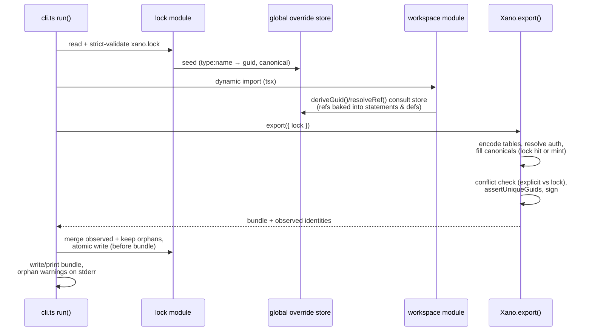

# feat: xano.lock identity lock file for stable guids and canonicals

## Summary

Add an opt-in `xano.lock` file, written/updated by `sidestep export`, that freezes every object identity the SDK would otherwise derive — object guids and api-group/toolset canonicals — so identities stay fixed across exports and renames. The lock is consulted before the workspace module loads (references bake guids at authoring time), becomes the ledger for explicit rename tracking, and gains maintenance subcommands (`lock rename`, `lock prune`, `lock adopt`).

## Problem Frame

sidestep derives object guids deterministically as `md5(payloadKey:name)` (`src/refs/guid.ts`). The Xano engine syncs by guid: a partial import matches `(workspace, branch, guid)` and updates in place — so a rename in code silently changes the guid and syncs as delete+create, orphaning the server-side object and its history. Only a manually-set `guid` on a def survives a rename today, and that requires per-object effort.

Separately, api groups and toolsets (MCP servers/agents) carry a `canonical` — the public URL token. sidestep emits it empty, so the engine randomizes it on every fresh import: the same code deployed to two environments gets two different public API/MCP URLs. (On guid-matched updates the engine keeps the existing canonical, so this only bites at object creation.)

The goal is workspace-as-code as the full source of truth for a team: identities must be stable between changes, environment imports must be reproducible, and renames must be trackable so they sync as updates.

---

## Requirements

**Lock semantics**

- R1. When a lock file is present, every auto-derived guid emitted in a bundle comes from the lock entry for that `(type, name)` when one exists; objects without an entry fall back to derivation and are appended to the lock on write-back.
- R2. Explicit in-code `guid`/`canonical` values always win at emit. The lock records them too, so later removing an explicit value from code does not silently change identity.
- R3. Within one bundle, every reference and its target agree on a single guid per object. A mismatch between an explicit in-code guid and the lock entry (which references may have resolved through) is a hard export error with remediation guidance — never a silently split bundle.

**Canonical stability**

- R4. An api_group or toolset with no explicit `canonical` gets one minted at its first locked export (8-char websafe token, matching the engine's `generateCanonical` format), frozen in the lock, and emitted in every subsequent bundle — so fresh imports of the same code land on the same public URLs.
- R5. The lock schema can represent the workspace config's `canonical` and `realtime.canonical` under fixed keys (not keyed by the renameable workspace name).

**Rename tracking and lock lifecycle**

- R6. A lock entry whose `(type, name)` matches no exported object is an orphan: export succeeds but warns on stderr, naming the exact `sidestep lock rename` command to run if it was a rename. Orphans persist until explicitly pruned — never auto-matched to new objects.
- R7. `sidestep lock rename <kind> <old> <new>` moves an entry to the new name keeping its identity values, so the next export emits the original guid under the new name and the engine renames in place.
- R8. `sidestep lock prune` removes orphaned entries, listing any canonicals being discarded (a pruned canonical's URL is unrecoverable).
- R9. `sidestep lock adopt <live-bundle.json>` seeds/updates the lock from a real engine `packageExport` bundle — capturing the live workspace's random guids and canonicals by `(type, name)` so existing workspaces can be adopted into code without a delete+create sync.

**CLI behavior and safety**

- R10. `sidestep export` auto-reads `xano.lock` beside the entry file when present; `--lock [path]` opts into creating one (and overrides the path). The lock is written atomically (temp+rename) before the bundle is emitted, and the write is idempotent (unchanged content is not rewritten).
- R11. An invalid lock — unparseable JSON, unknown version, duplicate keys in the raw text (a botched git merge survives `JSON.parse` silently), or duplicate guid values — is a hard export error. A broken lock never degrades to a silent unlocked export.
- R12. The programmatic surface (read/validate, seed, reset, collect/write helpers) is exported from the package index with a documented contract: seeding must happen before any def module is evaluated, once per process.

---

## Key Technical Decisions

- **Pre-import seeding through a cross-realm override store, consulted inside `deriveGuid`.** Reference guids are baked at authoring time: statement factories (`src/statements/special/calls.ts`, `special/db.ts`, `special/misc.ts`, `special/ai-cloud.ts`) and even field defs (`f.tableRef` in `src/fields/catalog.ts`) call `resolveRef` → `deriveGuid` the moment the workspace module is evaluated, and some embed the guid **inside strings** (`dbo=<guid>` method args, auth-token const values). An export-time payload rewrite would have to chase those string-embedded forms and would still miss future ones; overriding at the `deriveGuid` choke point makes reference and target agree everywhere by construction. The store lives on `globalThis` under a `Symbol.for` key because the CLI and the workspace entry can load sidestep in different module realms (the tsx-loader split — same reason `Xano.isXano` uses the `XANO_BRAND` symbol in `src/workspace/xano.ts`).
- **The lock records all identities, including explicit ones.** The user-facing rule is "locks anything not manually set," but recording explicit values too (at their explicit value) closes two holes: removing an explicit `guid` from code later resolves through the lock to the same value instead of silently reverting to `md5(name)` (a delete+create on next sync), and `lock adopt` has a place to put captured live values. Precedence at emit is unchanged: explicit code value > lock > derivation.
- **First-lock guid values keep today's md5 derivation, just frozen.** Workspaces already synced from sidestep keep their identities when the lock is introduced; the lock's value diverges from derivation only through rename fix-ups and adoption. (Rejected: engine-style random guids at first lock — would break every existing synced workspace.)
- **Canonicals are minted randomly, not name-derived.** Canonicals are public URL tokens; deriving them from names would make API paths guessable. Minting matches engine behavior (`MVP::generateCanonical`: 8-char websafe from crypto randomness). This is the repo's first intentional randomness — it stays confined to the lock module, and output determinism is preserved because a minted value is immediately frozen in the lock.
- **Lock keys are `payloadKey:name`** — the same seed the guid derivation uses (`dbo:users`, `app:public`, `function:sayHello`), so the mapping between lock entries and derivation is 1:1 and kind-name aliases (`table`→`dbo`, `api_group`→`app`) are resolved at the CLI boundary. Workspace singletons use fixed keys (`workspace`, `workspace:realtime`).
- **Write ordering: mint canonicals → validate bundle → write lock → emit bundle.** Never ship a bundle containing identities the lock hasn't durably recorded; a crash between the two writes must not orphan freshly minted canonicals (they'd be regenerated differently next run).
- **Renames are never guessed.** Orphan + newcomer detection only warns with the exact fix-up command; auto-matching orphans to new objects of the same kind risks silently welding the wrong identity onto an object.
- **Lock path defaults to `xano.lock` beside the entry file**, `--lock <path>` overrides — the escape hatch for directories with multiple workspace entries (whose lock files would otherwise commingle keys and cross-report orphans).

---

## High-Level Technical Design

Export pipeline with the lock in play (CLI path):



Lock file shape (directional guidance, not a spec — exact fields settle in U1):

```json
{
  "version": 1,
  "objects": {
    "app:public": { "guid": "…32-hex…", "canonical": "AbC12dEf" },
    "dbo:users": { "guid": "…" },
    "function:sayHello": { "guid": "…" },
    "toolset:assistant": { "guid": "…", "canonical": "…" },
    "workspace": { "canonical": "…" },
    "workspace:realtime": { "canonical": "…" }
  }
}
```

Keys sorted on write for stable diffs; the file is human-editable JSON (hand-editing an entry is a supported fix-up path alongside the subcommands).

---

## Implementation Units

### U1. Lock file model: schema, strict read, atomic write

- **Goal:** A `src/lock/` module owning the lock file format — parse, validate, serialize — with no knowledge of the export pipeline.
- **Requirements:** R5, R10 (atomicity/idempotence), R11
- **Dependencies:** none
- **Files:** `src/lock/lock.ts`, `test/lock/lock.test.ts`
- **Approach:** Versioned JSON (`version: 1`), `objects` map keyed `payloadKey:name` plus fixed workspace keys; entries carry `guid?` and `canonical?`. Strict validation: version gate, a raw-text duplicate-key scan before `JSON.parse` (parse keeps the last duplicate silently — the botched-merge case), guid-value uniqueness, key/value shape checks. Serializer sorts keys; writer goes temp-file+rename and skips the write when bytes are unchanged. Follow the repo's heavy-header-comment convention explaining the identity model.
- **Test scenarios:**
  - Round-trip: parse(serialize(lock)) is deep-equal; keys emerge sorted regardless of insertion order.
  - Duplicate raw keys (`"function:a"` twice, as a merge would produce) → validation error naming the key.
  - Duplicate guid values across two entries → error naming both keys.
  - Unknown `version: 2` → error telling the user to upgrade sidestep.
  - Unparseable JSON → error including the file path.
  - Idempotent write: writing identical content leaves mtime/bytes untouched; changed content replaces atomically.
  - Fixed workspace keys accepted; `workspace:<name>` style keys rejected or normalized (decide in impl, test the decision).

### U2. Cross-realm override store wired into guid derivation

- **Goal:** A seedable override store that `deriveGuid` consults, making locked guids flow to every reference and target — including string-embedded ones — with zero changes at call sites.
- **Requirements:** R1, R2 (the resolves-through-lock half), R12
- **Dependencies:** U1
- **Files:** `src/lock/store.ts` (or colocated in `src/lock/lock.ts`), `src/refs/guid.ts`, `test/lock/store.test.ts`, `test/refs/guid.test.ts`
- **Approach:** Store on `globalThis[Symbol.for("sidestep.lock")]` holding the seeded `key → {guid, canonical}` map. `seedLockOverrides(lock)` / `resetLockOverrides()` exported; `deriveGuid(type, name)` checks the store before hashing. Contract (documented on the functions): seed once per process, before any def module is evaluated; seeding after defs have loaded is a silent no-op for already-baked references — `reset` exists for tests. Canonical lookups get a sibling accessor for U3.
- **Test scenarios:**
  - Store hit: `deriveGuid("function","renamed")` returns the seeded guid, not md5.
  - Store miss falls back to md5 unchanged; empty/unseeded store leaves all existing `test/refs/guid.test.ts` expectations green.
  - `resolveRef` with a def handle carrying an explicit guid still wins over the store.
  - Store survives a simulated second module realm (access via a fresh `Symbol.for` lookup, not a module-local reference).
  - Reset clears overrides; sequential seed→reset→seed behaves per contract (the one-workspace-per-process rule).
  - A statement factory (e.g. `s.function.run`) and `f.tableRef` both emit the seeded guid, proving string-embedded forms agree.

### U3. Lock-aware export: canonical fill, identity collection, conflict detection

- **Goal:** `Xano.export()` participates in locking — fills empty canonicals from the lock (minting on first sight), reports every identity it emitted, and hard-errors on explicit-vs-lock splits.
- **Requirements:** R2, R3, R4, R5 (emission side)
- **Dependencies:** U1, U2
- **Files:** `src/workspace/xano.ts`, `src/lock/lock.ts` (mint helper), `src/workspace/export.ts` (error-message touch only), `test/workspace/lock-export.test.ts`
- **Approach:** `export()` gains an optional options bag (`export({ lock? })`, backward compatible). When a lock context is present: for each api_group/toolset payload whose `canonical` is empty, use the locked canonical or mint one (8-char websafe via `node:crypto` randomness, engine format) and record it; walk the final payload collecting `(key, guid, canonical)` for every guid-bearing object — this observed set (not the global store) is what the CLI merges into the lock, so multi-workspace processes can't leak entries across locks. Conflict detection: an object whose payload guid (explicit) differs from the seeded store value for its key → throw with remediation ("update the xano.lock entry to the explicit guid, or remove the explicit guid, then re-export"). Extend the `assertUniqueGuids` failure text to mention lock-pinned guids ("guid pinned by lock entry `function:new` — renamed from `old`") when a lock context can attribute the collision.
- **Test scenarios:**
  - First locked export of an api group with empty canonical mints an 8-char websafe token, emits it in the bundle, and reports it in the observed set.
  - Second export with that canonical in the lock emits the identical token (no re-mint).
  - Explicit `canonical` in code is emitted verbatim and recorded; lock value never overrides it.
  - Explicit guid matching the lock entry exports cleanly; explicit guid differing from the lock entry throws the conflict error naming the object and both values.
  - Observed-identity collection covers all guid-bearing kinds in a mixed workspace (function, table→`dbo`, query, api_group→`app`, toolset, trigger) plus workspace canonicals under fixed keys.
  - Swap/reuse: after a rename fix-up, a new object taking the old name derives the pinned guid → duplicate-guid error text points at the lock entry, not the misleading "two objects share a name."
  - `export()` with no options behaves byte-identically to today (existing conformance/export tests stay green).

### U4. CLI integration: auto-read, seed, write-back, warnings

- **Goal:** `sidestep export` becomes lock-aware end to end: detect/read/seed before the workspace module loads, write the lock back before the bundle, surface orphans loudly.
- **Requirements:** R1, R6 (warning side), R10, R11 (enforcement point)
- **Dependencies:** U1, U2, U3
- **Files:** `src/emit/cli.ts`, `src/emit/emit.ts` (only if the write path needs a hook), `test/workspace/cli-lock.test.ts`
- **Approach:** In `run()`, before `loadDefault(file)`: resolve the lock path (default `dirname(resolve(file))/xano.lock`, `--lock [path]` flag added to `parseArgs`), read+validate when present (invalid → hard error per R11), seed the store. Missing lock without `--lock` → stderr notice ("exporting without xano.lock; identities derived from names") and proceed unlocked. After `export({ lock })`: merge observed identities into the lock model (new entries appended, orphans preserved), atomic idempotent write, **then** write/print the bundle. Orphan warnings to stderr only (stdout may be a piped bundle), each naming the exact `sidestep lock rename <kind> <old> <new>` invocation. Also seed the store for the `compile` command when a lock sits beside the entry, so single-function artifacts agree with locked bundles.
- **Test scenarios:**
  - `--lock` on a lock-less directory creates `xano.lock` containing every exported identity; bundle guids equal lock guids.
  - Steady-state re-export changes neither the lock bytes nor the bundle.
  - Rename in the fixture workspace → export warns on stderr with the exact rename command, bundle carries the *new* md5 guid (unlocked-name behavior), lock keeps the orphan and gains the new entry.
  - After `lock rename` fix-up (edit the lock as U5 would), export emits the *original* guid under the new name.
  - Corrupt/duplicate-key lock file → export exits non-zero before importing the workspace module.
  - Warnings never appear on stdout when the bundle streams to stdout.
  - Lock write-back lands before bundle write (observable via ordering with an injected failure or file timestamps).
  - `compile` with an adjacent lock emits locked guids in the single-function artifact.

### U5. Lock maintenance subcommands: rename, prune, adopt

- **Goal:** First-class fix-up flows so lock surgery never requires hand-editing (though hand-editing stays supported).
- **Requirements:** R7, R8, R9
- **Dependencies:** U1 (U4 for shared CLI plumbing)
- **Files:** `src/emit/cli.ts`, `src/lock/lock.ts` (mutation helpers), `test/workspace/cli-lock-commands.test.ts`
- **Approach:** A `lock` command namespace: `sidestep lock rename <kind> <old> <new> [--lock <path>]` accepts kind names *or* payloadKeys (`table`/`dbo`, `api_group`/`app` map internally), validates old key exists and new key doesn't, moves the entry intact. `sidestep lock prune` removes entries not present in the current export — it needs the workspace entry file to know what exists, so it takes the entry path; it lists discarded canonicals in the confirmation output (non-interactive: require `--yes` or print-and-exit-1 style, decide in impl). `sidestep lock adopt <bundle.json> [--lock <path>]` parses a live engine `packageExport`, walks the guid-bearing payload sections extracting `(payloadKey, name, guid, canonical?)`, and writes/overwrites lock entries — the adoption path that lets code take over an existing workspace without a delete+create sync.
- **Test scenarios:**
  - Rename: entry moves with guid+canonical intact; unknown old key errors; existing new key errors; kind-name alias `table` targets a `dbo:` entry.
  - Prune: orphans removed, live entries kept; output lists each discarded canonical; refuses without confirmation flag.
  - Adopt: a fixture live bundle (with engine-style ~27-char guids and populated canonicals) produces lock entries keyed correctly per section; re-adopt overwrites existing values; a non-bundle JSON errors cleanly.
  - Adopt then export: bundle emits the adopted (engine-format) guids, proving format-agnostic flow through the store.

### U6. Public surface, docs, and manifest

- **Goal:** The lock is discoverable and documented; stale claims are corrected.
- **Requirements:** R12
- **Dependencies:** U1-U5
- **Files:** `src/index.ts`, `README.md`, `src/manifest/manifest.ts`, `manifest.json`, `llms.txt`, `docs/plans/2026-06-24-002-feat-sidestep-full-workspace-sdk-plan.md`
- **Approach:** Re-export the lock module surface (read/validate/seed/reset/mutation helpers) from `src/index.ts` in a new grouped section. README: extend the Emit & CLI section with the lock flags and subcommands, add a short "Identity & the lock file" subsection covering precedence (explicit > lock > derived), the rename workflow, the adopt workflow, and the scoped promise (the lock freezes the existing identity scheme — it does not fix finer-grained identity like query-verb collisions). Correct the stale "generating engine-side ids/guids" out-of-scope lines in README and mark the superseded line in the old plan doc. Update `manifest.ts` authoring-surface strings if def semantics changed (none expected — CLI-only surface), regenerate via `npm run manifest` if `manifest.ts` was touched so the freshness tests stay green. Add `@TODO(verify)` markers at the not-yet-live-verified behaviors (rename-syncs-as-update, adopt-avoids-duplicate-sync, workspace-canonical provisioning semantics).
- **Test expectation:** none — documentation and export wiring; `test/manifest/manifest.test.ts` freshness guard covers the manifest half.

---

## Scope Boundaries

**In scope:** everything above — lock read/write, guid/canonical freezing, rename/prune/adopt subcommands, programmatic seeding API.

### Deferred to Follow-Up Work

- **Live engine round-trip verification** of the headline flows (export → import → rename → re-export → sync updates in place; adopt → sync without duplicates). The engine behavior is established by code reading (`Migrate.php` `createOrUpdate`, canonical handling), but the repo's own history shows live imports catch what fixtures miss. Tracked via `@TODO(verify)` markers; pairs with the user's separate import-feedback harness.
- **Automatic rename inference** (matching orphans to newcomers by content similarity or interactive prompt) — explicitly rejected for now; revisit only with real-world demand.
- **`--require-lock` CI hardening** (hard-fail when the lock is expected but absent — e.g. a workspace-level `requireLock` option). The stderr notice covers the gap initially; add enforcement if a missing-lock incident actually occurs.
- **Watch mode / multi-export process reuse.** The store contract is one workspace per process; relaxing it (scoped stores) is future work.

**Outside this feature's identity:** changing the identity scheme itself (per-verb query identity, content-hash identity), live push/deploy to an instance, and lock-file support for marketplace/install payload sections (`vault`, `market_item`, …) that sidestep doesn't author.

---

## Risks & Dependencies

- **Canonical uniqueness is instance-wide, not workspace-wide.** On a partial import creating a new api_group/toolset, the engine regenerates the canonical if it collides with *another workspace on the same instance* — so one lock imported into two workspaces on one instance yields URL parity for the first and a regenerated canonical for the second. Nothing SDK-side can prevent this; document that canonical parity holds across instances (or non-colliding workspaces), and note the engine self-heals rather than fails.
- **Guid-matched updates keep the server's canonical.** Verified in `Migrate.php`: on update, the incoming canonical is ignored in favor of the existing one. Consequence worth documenting: turning on the lock against an already-deployed workspace does not break existing URLs (locked canonicals only apply to objects created after locking) — and `lock adopt` is the way to make the lock reflect live values exactly.
- **Full (non-partial) imports regenerate guids** (except `service`): the lock's identity guarantees apply to the partial/sync import path, which is the multi-environment workflow. Scope the documentation to that path.
- **Workspace-canonical provisioning semantics are the least-verified corner** (`provisionWorkspace` matches by canonical and regenerates on collision, restore path returns the existing workspace). The lock schema carries the fixed workspace keys either way; emission behavior gets an `@TODO(verify)` and conservative documentation.
- **The seed-before-import contract is honor-system for programmatic users.** Node's module cache makes late seeding a silent partial no-op. Mitigated by documentation, the `reset` helper for tests, and the fact that the CLI — the primary path — always seeds correctly.

---

## Sources & Research

- `src/refs/guid.ts` — derivation + `resolveRef`; the module doc comment is the identity-model contract this feature extends.
- `src/workspace/xano.ts` (`encodeOne`, `export()`) — guid stamping, table lazy-encode, auth-guid resolution; `src/workspace/export.ts` (`assertUniqueGuids`, `calcSignatureJson`) — everything lock-applied must precede signing.
- `src/emit/cli.ts` (`run()`, `loadDefault`) — the only pre-module-import hook point with filesystem context; note the tsx realm split worked around via `Symbol.for` branding.
- String-embedded guid sites that rule out export-time rewriting: `src/fields/catalog.ts` (`f.tableRef` method arg), `src/statements/special/misc.ts` (`createAuthToken` input const).
- Engine truth (cloud-client `extensions/MVP/includes/xano/helper/mvp/Migrate.php`): `createOrUpdate` partial-import guid matching and in-place rename with `_NN` name-collision suffixing; canonical generation/preservation (`generateCanonical` = 8-char websafe; kept on update; instance-wide collision regeneration on create); `provisionWorkspace` canonical/guid regeneration; full-import guid regeneration except `service`.
- `test/helpers/normalize.ts` strips `guid` — lock tests must assert on raw bundles, not normalized fixtures, or they pass vacuously.
- Prior art in-repo: explicit `guid` def override (chosen over a `key`→md5 seed precisely because only a verbatim guid can adopt live workspaces) — the lock generalizes that mechanism file-wide.
