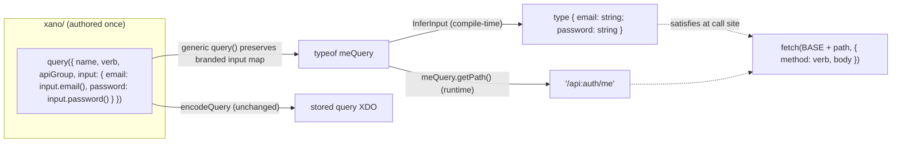

# feat: Query URL path export + inferred input types for consumers

## Summary

Turn a sidestep `query()` def into a **shared backend↔frontend contract**. A downstream
template/frontend that imports a query def should be able to:

1. Get the endpoint's group-relative URL path at runtime — `meQuery.getPath()` → `/api:<canonical>/<name>` — droppable into `fetch(BASE + path, ...)`.
2. Type-check the request payload against the query's declared inputs — `InferInput<typeof meQuery>` yields a TS type (`{ email: string; password: string }`) with no codegen and zero drift.

Both are achieved by (a) carrying each input's **value type** at the TypeScript type level (phantom brands, no runtime change), (b) making `query()` generic so `typeof meQuery` preserves the per-field input map, and (c) attaching a `getPath()` method that resolves the api group's canonical.

**Resolved forks (see Key Technical Decisions):**
- `getPath()` returns a **group-relative path** (`/api:<canonical>/<name>`) — sidestep stays out of host/env concerns.
- Input types are surfaced via **type-level inference** (`InferInput<typeof meQuery>`) — chosen as the most AI-legible option: an agent imports the query and the payload is type-checked directly, always in sync with the def, no generated file to regenerate or import.

---

## Problem Frame

sidestep compiles a whole Xano workspace from typed TS defs. Today those defs are consumed only by the compiler (`encodeQuery` → stored JSON). They are **not** reusable as a contract by the code that *calls* the resulting API. A frontend developer (or an AI editing a frontend that depends on a published extension package like [`@sidestep/auth`](https://github.com/sidestepai/auth)) must hand-write the endpoint URL and hand-type the request body, duplicating what the query def already declares and drifting when it changes.

The target usage (from the request):

```ts
import { meQuery } from "@sidestep/auth/src/api/me";   // a sidestep query() def

export class LoginPage {
  private readonly mePath = meQuery.getPath();     // "/api:auth/me"

  submit() {
    fetch(BASE + this.mePath, {                    // caller owns BASE (host)
      method: meQuery.verb,                         // already on the def
      body: JSON.stringify({ email: "j@x.com", password: "" } satisfies InferInput<typeof meQuery>),
    });
  }
}
```

The def is already the single source of truth for the path (name + api group) and the inputs — this feature exposes that truth to consumers.

---

## Background: how a Xano URL is shaped (constrains `getPath`)

A Xano endpoint URL is `https://<host>/api:<canonical>/<query-name>`:

- **`<host>`** — instance-specific (e.g. `x8ki-letl-twmt.n7.xano.io`), never known at authoring time. **Out of scope** by the resolved fork — the caller prepends it.
- **`api:<canonical>`** — the api group's URL token. Set explicitly via `apiGroup({ canonical })`, **or** left empty and minted into `xano.lock` at export ([src/workspace/xano.ts](src/workspace/xano.ts) `applyLock`). When empty, the real canonical is **not** knowable from the def alone.
- **`<query-name>`** — the query's `name` is its path within the group (Xano treats the endpoint name as the path segment).

Consequence: `getPath()` can only produce a correct group-relative path when the canonical is resolvable from the def (an explicit `canonical` on the api group handle) or supplied as an override. This is honest and correct for a shareable package, where the canonical should be pinned anyway. See KTD-3 and Risks.

---

## Key Technical Decisions

### KTD-1 — Type-level inference, not codegen (the AI-legibility choice)
Surface input types via a generic `InferInput<Q>` utility type, computed from the query's typed `input` map at compile time. Rejected: CLI-generated `.d.ts` named interfaces.

**Rationale (optimizing for "an AI imports a query and understands its inputs easiest"):**
- The query def source *already* reads as the input contract (`input: { email: input.email(...), password: input.password(...) }`). Inference makes the **call site** type-safe on top of that self-documenting source — an agent writing a `fetch` payload gets completion + errors directly from `typeof meQuery`, with no second artifact to discover.
- Zero drift: the type is derived from the def, so it can never lag a codegen step. Codegen introduces a regenerate-or-be-wrong failure mode that is exactly the kind of trap an AI falls into.
- No build step / no import-from-generated-file friction; works the instant the package is installed.
- Idiomatic and low-risk — mirrors `zod`'s `z.infer`, tRPC's `inferRouterInputs`, and `ts-rest` contracts, all of which infer request types from value schemas without codegen.

Codegen'd named interfaces (`IMeQuery` as a literal import) are recorded as an optional future upgrade (see Scope Boundaries → Deferred), layered on the same inference core.

### KTD-2 — Phantom value-type brands on input constructors (no runtime change)
`InferInput` needs each input descriptor to carry its value type statically. The value layer is **fully type-erased today** (`input.text()` → `{ type: string; options: FieldOptions }`). Enrich the constructor *return types* with a phantom brand (`InputDescriptor & Brand<TValue, TOpts>`) that is never present at runtime — the emitted object stays exactly `{ type, options }`, so `encodeInput`/`encodeQuery` output is byte-identical.

Capture each call's options as a `const` type parameter (`input.text<const O>(o?: O)`, TS 5.0+; repo is on TS ^5.5) so `required` / `array` / `nullable` / `values` are read as literal types and can modulate optionality and cardinality. Value type map:

| Stored type | TS value | Notes |
|---|---|---|
| text, email, password, uuid, date | `string` | |
| int, decimal, epochms (timestamp) | `number` | |
| bool | `boolean` | |
| enum | union of `values` literals | e.g. `"draft" \| "live"` |
| json | `unknown` (JSON-ish) | |
| obj (object) | recurse over `children` | |
| blob / blob_img / blob_video / blob_audio | named `XanoFileRef` (opaque) | file resource, not the raw file |
| geo_* | named `XanoGeoJson` (opaque object) | |
| vector | `number[]` | |
| tableRef | `number \| string` | the referenced PK |
| `array: true` | `T[]` | |
| `required` not `true` | optional key (`?`) | presence |
| `nullable: true` | `T \| null` | |

### KTD-3 — `getPath()` returns a group-relative path; canonical resolved from the def, override allowed
Signature: `getPath(opts?: { canonical?: string }): string` → `/api:<canonical>/<normalized-name>`.
Resolution order for the canonical: `opts.canonical` → `apiGroup` handle's non-empty `canonical` → **throw** a descriptive error (never fabricate a token). The error tells the author to set an explicit `canonical` on the api group or pass one to `getPath` — because an empty canonical is minted into `xano.lock` at export and is not knowable from the def. Name is normalized to exactly one leading slash and no scheme/host is added (resolved fork). The HTTP verb stays available as `meQuery.verb` (already on the def) — `getPath` intentionally returns only the path string.

### KTD-4 — Keep authoring functional; `getPath` is an additive method on the factory return
Per the project's functional/descriptor authoring stance ([[sidestep-authoring-style]]), the def stays plain data plus one method. `query()` returns `def & { getPath }`; the method is the only non-data addition and is dropped by `JSON.stringify` and ignored by `encodeQuery` (which reads named fields), so serialization/round-trip/deep-equal conformance is unaffected. The user explicitly requested the `meQuery.getPath()` shape, so honor that ergonomics rather than a standalone helper. `InferInput` is a type (no runtime footprint at all).

### KTD-5 — Make `query()` generic; inference works for any input-bearing def
`query<const I extends Record<string, InputDescriptor>>(def: QueryDef & { input?: I })` preserves the branded input map on `typeof meQuery`. `InferInput<Q>` reads `Q["input"]`, so it also works unchanged for `defineFunction` (functions share the input system) — functions are covered for free even though the URL half is query-only.

---

## High-Level Technical Design

Two independent derivations off one authored def. The type track is compile-time only; the runtime track adds one string method.



`InferInput` mapping (directional pseudo-grammar, not implementation spec):

```
InferInput<Q>            = FromMap<Q["input"]>
FromMap<M>               = optionalize({ [K in keyof M]: FieldValue<M[K]> })
FieldValue<D>            = arrayify< nullify< base(D) > >     // read D's phantom brand
base(text|email|...)     = string
base(int|decimal|epoch)  = number
base(enum<V>)            = V[number]
base(obj<C>)             = FromMap<C>
base(list<E>)            = FieldValue<E>[]                    // element brand
arrayify<T>              = D.array extends true ? T[] : T
nullify<T>               = D.nullable extends true ? T | null : T
optionalize             = make key optional unless D.required extends true
```

---

## Implementation Units

### U1. Value-type brands on input (and delegated field) constructors
**Goal:** Enrich `input.*` return types with a phantom value/opts brand so downstream types can read each field's value type, required-ness, nullability, and array-ness — with **no runtime change**.
**Requirements:** Enables KTD-1/KTD-2; foundation for U2.
**Dependencies:** none.
**Files:**
- `src/inputs/input.ts` — make each constructor capture options as `const O` and return `InputDescriptor & InputBrand<TValue, O>`; recurse for `object`/`list`; `enum` brands the value union.
- `src/inputs/brand.ts` *(new)* — `InputBrand<V, O>` phantom type + the value-type map helpers (`Scalarize`, `Arrayify`, `Nullify`).
- `src/fields/catalog.ts` — the `f.*` constructors that `input.*` delegates to (image/video/audio/attachment/geo/vector/tableRef/object) gain the same brand so delegated inputs infer correctly; `f`-only column usage is unaffected.
- `src/types/xdo.ts` / `src/fields/field.ts` — export any shared opaque value types (`XanoFileRef`, `XanoGeoJson`) referenced by the map.
- `test/inputs/brand.test.ts` *(new, type tests)*.
**Approach:** Brands are `& { readonly __v?: V; readonly __o?: O }`-style phantoms (optional, never assigned) so the runtime object is untouched and existing `InputDescriptor`-typed consumers (e.g. `Record<string, InputDescriptor>` params) still accept branded values by structural assignability. Do not change `encodeInput`/`encodeField` at all.
**Patterns to follow:** `MethodOpts<N>`/`MethodArg<N>` generics already in [src/fields/catalog.ts](src/fields/catalog.ts) and [src/inputs/input.ts](src/inputs/input.ts); vitest `expectTypeOf` type tests in [test/types-xdo.test.ts](test/types-xdo.test.ts).
**Test scenarios** (type-level, vitest `expectTypeOf`/`assertType`):
- `input.text()` brands value `string`; `input.int()`/`input.decimal()`/`input.timestamp()` → `number`; `input.bool()` → `boolean`.
- `input.enum(["draft","live"])` brands value `"draft" | "live"` (literal union, not `string`).
- `input.text({ required: true })` marks required; `input.text()` marks not-required.
- `input.text({ nullable: true })` brands nullable; `input.list(input.text())` brands array element `string`.
- `input.object({ name: f.text(), age: f.int() })` brands a nested `{ name: string; age: number }`.
- **Runtime regression:** `input.text({ required: true })` still returns exactly `{ type: "text", options: { required: true } }` (deep-equal) — the brand adds no enumerable keys. `JSON.stringify` output unchanged.
- Integration: `Object.entries(def.input).map(encodeInput)` compiles and produces identical XDO as before (guard against the brand leaking into runtime).

### U2. `InferInput` request-payload mapper + public type
**Goal:** The mapped type that converts a query/function def's branded `input` map into the request-payload TS type, with optional keys, `null`, arrays, enums, and nested objects handled per KTD-2.
**Requirements:** Delivers the input-validation half of the feature.
**Dependencies:** U1.
**Files:**
- `src/inputs/infer.ts` *(new)* — `InferInput<Q>` (reads `Q["input"]`), plus internal `FromInputMap`, `FieldValue`, and the optionalize/nullify/arrayify helpers.
- `test/inputs/infer.test.ts` *(new, type tests)*.
**Approach:** `InferInput<Q>` = `FromInputMap<NonNullable<Q["input"]>>`. Split keys into required vs optional via a two-part mapped type (`{ [K in RequiredKeys]: V } & { [K in OptionalKeys]?: V }`) so optionality is real (`?`), not `V | undefined`. Works off `Q["input"]` so it applies to both `query()` and `defineFunction()` defs.
**Patterns to follow:** existing conditional/mapped type usage in `src/types/xdo.ts`.
**Test scenarios** (type-level):
- Two-input query → `{ email: string; password: string }` (both required).
- Mixed required/optional → optional inputs become `?` keys (assigning `{}` for an all-optional query compiles; omitting a required key errors via `@ts-expect-error`).
- `nullable` input → `T | null`; `list` input → `T[]`; `enum` input → literal union; nested `object` input → nested type.
- Empty/absent `input` → `{}` (or `Record<string, never>`); assigning `{}` compiles.
- `InferInput<typeof someFunctionDef>` (a `defineFunction` handle) resolves the same way (cross-kind reuse).
- `@ts-expect-error` when passing a wrong-typed value (e.g. `number` for a `string` input).

### U3. Generic `query()` + `getPath()`
**Goal:** Preserve the branded input map on `typeof meQuery` and attach a runtime `getPath()` returning the group-relative path with canonical resolution.
**Requirements:** Delivers the URL half; makes `InferInput<typeof meQuery>` resolve precisely.
**Dependencies:** U1 (brands), U2 (so `getPath` sits on the same enriched return).
**Files:**
- `src/kinds/query.ts` — make `query()` generic over `I extends Record<string, InputDescriptor>`; return `QueryDef<I> & { getPath(opts?: { canonical?: string }): string }`; implement `getPath` (canonical resolution + name normalization + error). `encodeQuery` unchanged.
- `test/kinds/query.test.ts` — extend with `getPath` + type-preservation tests.
**Approach:** `getPath` resolution: `opts?.canonical` → (`apiGroup` is an object handle && non-empty `canonical`) → else throw `Error` naming the query and the fix ("set an explicit canonical on the api group, or pass getPath({ canonical })"). Path = `` `/api:${canonical}/${name.replace(/^\/+/, "")}` ``. The method is attached to the returned def (KTD-4); keep the def otherwise plain. Verb is *not* included.
**Patterns to follow:** existing `query()` factory and `resolveRef`/handle-vs-string handling in [src/kinds/query.ts](src/kinds/query.ts); error-message style in [src/workspace/xano.ts](src/workspace/xano.ts).
**Test scenarios:**
- `getPath()` with an api group handle carrying `canonical: "auth"` and query name `me` → `/api:auth/me`.
- Name with a leading slash (`"/me"`) or nested (`"auth/me"`) → single leading slash, no doubling: `/api:auth/me`, `/api:auth/auth/me`.
- `getPath({ canonical: "override" })` wins over the handle's canonical.
- api group is a **bare string name** (no canonical available) and no override → throws with a message naming the query and the remedy.
- api group handle with **empty** `canonical` and no override → throws (documents the lock-minted-canonical constraint).
- No `apiGroup` at all → throws.
- **Regression:** `encodeQuery(query({...}))` output is byte-identical to pre-change (attaching `getPath` did not alter the XDO); `JSON.stringify(meQuery)` does not include `getPath`.
- Type: `typeof meQuery` preserves the input brands so `InferInput<typeof meQuery>` yields the precise payload type (`expectTypeOf`).

### U4. Public exports, docs, and end-to-end consumer example
**Goal:** Export the new public surface and document the consumer contract so an AI/developer discovers it.
**Requirements:** Ships the feature as usable public API; closes the loop on the request's example.
**Dependencies:** U2, U3.
**Files:**
- `src/index.ts` — export `type { InferInput }` (and any exposed opaque value types `XanoFileRef`/`XanoGeoJson`); `query`/`QueryDef` already exported (verify the generic signature flows through).
- `readme.md` — a short "Consuming a query as a contract" section mirroring the `LoginPage` example (`getPath()` + `InferInput`), including the canonical/host caveats.
- `test/index.exports.test.ts` *(new or extend existing)* — asserts `InferInput` and `query().getPath` are reachable from the package entry.
- `llms.txt` / `manifest.json` — regenerate via `npm run manifest` **only if** the query-kind entry should note `getPath`/consumer types; otherwise add a one-line mention in the README's agent-grounding pointer. (Decision: keep manifest as SDK-surface truth; add a brief `getPath`/`InferInput` note to the query kind's manifest entry if cheap, else document in README.)
**Approach:** Additive exports only. Confirm `tsup` build still emits correct `.d.ts` for the generic `query` and `InferInput` (types-only exports must survive the build).
**Test scenarios:**
- Import `{ query }` and `type { InferInput }` from the built entry; `query({...}).getPath` is callable; `InferInput<typeof q>` resolves (type test).
- README example compiles as a `test/fixtures` snippet (a `.ts` file type-checked under `tsc --noEmit`) so the documented usage can't rot.
- `npm run build` + `npm run typecheck` green; `.d.ts` for `query` carries the generic and `InferInput` is exported.
- `Test expectation: none` for the pure prose sections of the README (doc-only).

---

## Scope Boundaries

**In scope:** `getPath()` (group-relative path) on `query()`; `InferInput` type inference for query (and, for free, function) inputs; the phantom brand mechanism; public exports + docs + a compile-checked example.

### Deferred to Follow-Up Work
- **Codegen'd named `.d.ts` interfaces** (`IMeQuery` as a literal import) layered on the inference core — the "Both" upgrade, if a named-import ergonomic is later wanted.
- **Full-URL / host assembly** (`configureXano({ base })`, absolute URLs) — explicitly out per the resolved fork; the caller prepends the host.
- **A typed fetch/request helper** (`meQuery.request(payload)`) — nice-to-have; this plan stops at `getPath()` + the payload type.
- **Response-type inference** (`InferOutput<typeof meQuery>` from the query's `response`/`output`) — the symmetric read side, not requested here.
- **Path-segment URL-encoding** of exotic query names — normalize leading slashes now; encoding is a small later hardening.

### Out of scope (not this feature)
- Resolving a lock-minted canonical from `xano.lock` inside `getPath` (getPath is a pure def method; it errors rather than reading lock state).
- Any change to `encodeQuery`/stored XDO shape or conformance goldens.

---

## Risks & Dependencies

- **Canonical unresolvable at `getPath` time (medium).** If an author leaves the api group's `canonical` empty (relying on lock minting), `getPath()` cannot produce a correct URL and throws. Mitigation: clear, actionable error; document that shareable packages (like @sidestep/auth) should pin an explicit `canonical`. This is correct-by-honesty — better than emitting a wrong/placeholder token.
- **`const` type-parameter inference friction (low-medium).** `<const O>` capture must not degrade existing call ergonomics or break `Record<string, InputDescriptor>` consumers. Mitigation: brands are additive intersections (structurally assignable to `InputDescriptor`); U1's runtime-regression tests + `typecheck` guard the whole existing suite.
- **Brand leaking into runtime (low).** A phantom that accidentally becomes a real key would corrupt the XDO. Mitigation: phantoms are optional-never-assigned; U1/U3 deep-equal + `JSON.stringify` regression tests catch any leak.
- **`.d.ts` emission for generics through `tsup` (low).** Verify the generic `query` and `InferInput` survive the build (U4).
- **Not verified against a live import.** No stored-XDO change, so conformance is unaffected; still, the "encode unchanged" claim is asserted by regression tests, not a live round-trip.

---

## Verification

- `npm run test` green, including the new type-level suites (`expectTypeOf`/`@ts-expect-error`) and the encode-unchanged regressions.
- `npm run typecheck` and `npm run build` green; built `.d.ts` exports `InferInput` and the generic `query`.
- The README `LoginPage`-style example compiles as a type-checked fixture.
- Manual sanity: in a scratch consumer, `meQuery.getPath()` returns `/api:<canonical>/<name>` and `payload satisfies InferInput<typeof meQuery>` errors on a wrong field type.

---

## Sources & Research

- Repo: [src/kinds/query.ts](src/kinds/query.ts), [src/kinds/api-group.ts](src/kinds/api-group.ts), [src/inputs/input.ts](src/inputs/input.ts), [src/fields/catalog.ts](src/fields/catalog.ts), [src/fields/field.ts](src/fields/field.ts), [src/workspace/xano.ts](src/workspace/xano.ts) (canonical minting), [src/index.ts](src/index.ts) exports, type-test pattern in [test/types-xdo.test.ts](test/types-xdo.test.ts).
- Memory: [[sidestep-authoring-style]] (functional/descriptor stance — informs KTD-4), [[sidestep-guid-sync-identity]] (canonical/guid model — informs KTD-3), [[sidestep-build-status]].
- Prior art for KTD-1 (type-level inference from value schemas, no codegen): `zod` `z.infer`, tRPC `inferRouterInputs`, `ts-rest` contracts.
