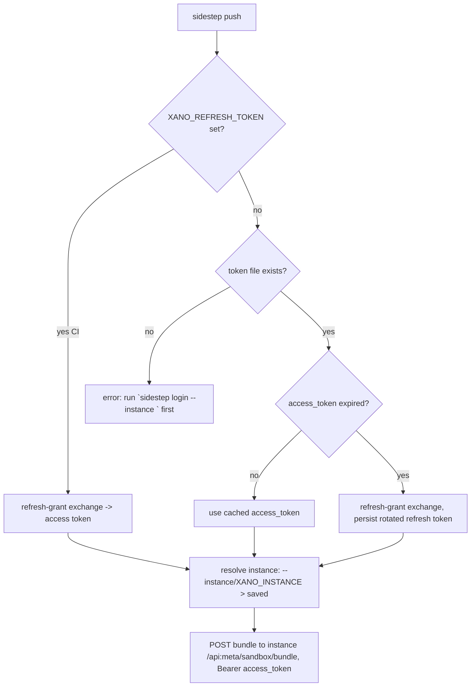

# feat: Migrate `sidestep push` auth from static credentials to OAuth

## Summary

`sidestep push` currently authenticates by reading a static Bearer `access_token` out of the `@xano/cli`-owned file `~/.xano/credentials.yaml` ([src/emit/push-command.ts](../../src/emit/push-command.ts) `loadProfile`). This plan replaces that with an **OAuth 2.1 authorization-code + PKCE flow** against the cloud-master control-plane OAuth server, using the already-seeded first-party `xano-cli` client. A new `sidestep login` command runs the interactive browser flow, and tokens (access + rotating refresh) are cached in a **project-local file that is auto-added to `.gitignore`**. `push` reads the cache, silently refreshes an expired access token, and — for CI — accepts a refresh token via environment variable so no browser is needed.

The work is entirely on the sidestep side and needs **no new runtime dependencies** — Node built-ins (`node:http` loopback server, `node:crypto` PKCE, global `fetch`, a small `child_process` browser launch) cover the whole flow, consistent with the repo's one-runtime-dep (`yaml`) discipline.

**Target OAuth server (reference only — not modified by this plan):** cloud-master, OAuth API under `api:master/oauth/*`, discovery at `/.well-known/oauth-authorization-server`. See the [cloud-master dependency](#cloud-master-dependency-and-the-loopback-redirect-risk) section for the one server-side coordination point.

---

## Problem Frame

- **Today:** `push` depends on `~/.xano/credentials.yaml` carrying a long-lived `access_token` + `instance_origin` per named profile. That file is externally managed by `@xano/cli` (`xano auth login`), read-only from sidestep' perspective, and its tokens are static bearer credentials.
- **Goal:** sidestep owns its own authentication. A user runs `sidestep login`, completes a browser consent once, and `push` works thereafter — refreshing tokens automatically. Credentials are short-lived OAuth tokens, stored so they can be reused, and never committed to git.
- **Why now:** the cloud-master OAuth server is live (its authorize/consent/token endpoints already serve MCP clients), and a first-party `xano-cli` client is seeded and configured for exactly the loopback authorization-code + PKCE flow this needs. Migrating removes sidestep' dependency on the separate `@xano/cli` login and on static credentials.

### Actors

- **Human developer** — runs `sidestep login` then `sidestep push` interactively; a browser is available.
- **CI job** — runs `sidestep push --bundle …` non-interactively; no browser; supplies a refresh token via env var.

### Key flows

1. **Interactive login** — `sidestep login --instance <origin>` → PKCE + loopback → browser consent → token exchange → tokens saved locally + `.gitignore` updated.
2. **Interactive push** — `sidestep push <file>` → read cached tokens → refresh if expired → `POST` bundle to `<instance>/api:meta/sandbox/bundle` with the OAuth access token.
3. **CI push** — `XANO_REFRESH_TOKEN=… sidestep push --bundle out.json --instance <origin>` → refresh-grant exchange → push. No file, no browser.

---

## Requirements

| ID | Requirement |
|----|-------------|
| R1 | A new `sidestep login` command runs the OAuth 2.1 authorization-code + PKCE (S256) flow against cloud-master using client_id `xano-cli` and a `127.0.0.1` loopback redirect, and persists the resulting tokens. |
| R2 | Login binds the token to a target instance via the RFC 8707 `resource` parameter; the instance origin comes from `--instance <origin>` (or `XANO_INSTANCE`) and is saved alongside the tokens. |
| R3 | Tokens (access, refresh, `expires_at`, `scope`, instance origin, auth host) are stored in a **project-local** file with `0600` permissions, written atomically (temp-file + rename). |
| R4 | On writing the token file, its path is **auto-appended to the project `.gitignore`** if not already ignored. |
| R5 | `push` resolves an access token from: (a) `XANO_REFRESH_TOKEN` env (CI, refresh-grant exchange), else (b) the cached token file — silently refreshing via the rotating refresh token when the access token is expired, persisting the new refresh token. |
| R6 | The target instance for `push` resolves as `--instance`/`XANO_INSTANCE` > the instance saved with the tokens. The push endpoint and the token `resource`/`aud` are the same instance origin. |
| R7 | All interactive prompts, "open this URL", and status output go to **stderr**; only the sandbox-import response body goes to stdout (preserves the existing pipe contract). |
| R8 | Missing/expired credentials produce actionable errors that name the exact command to run (e.g. `Run \`sidestep login --instance <origin>\` first`). |
| R9 | The auth host (cloud-master OAuth issuer/frontend origin) defaults to `https://app.xano.com`, overridable via `--auth-host`/`XANO_AUTH_HOST`; endpoints are resolved from the server's discovery document rather than hardcoded paths. |
| R10 | No new runtime dependencies; auth code is Node-only and lazily imported so `compile`/`export`/the browser-safe `index` bundle never pull in `node:http`/`child_process`. |

**Precedence convention (carried from existing code):** flag → env var → saved/default value, everywhere. Mirrors `loadProfile`'s `args.config ?? process.env.XANO_CONFIG ?? …`.

---

## Key Technical Decisions

### KTD1 — Authorization-code + PKCE with a loopback redirect (no device flow)

cloud-master's token endpoint supports exactly two grants: `authorization_code` (PKCE **mandatory**, S256 only) and `refresh_token` (rotating). **There is no RFC 8628 device flow** and no client-credentials grant. The seeded `xano-cli` first-party client is already configured for `authorization_code` + `refresh_token`, public (`token_endpoint_auth_method: none`), with a `127.0.0.1` loopback redirect. So the flow is fixed: generate a PKCE verifier/challenge, open the browser to the authorize UI, capture the `code` on a local loopback server, exchange it (with `code_verifier`) at the token endpoint.

### KTD2 — Reuse the first-party `xano-cli` client; discover endpoints, don't hardcode

Use `client_id=xano-cli` rather than registering a new DCR client per machine — it exists, is first-party, and carries the scopes push needs. Resolve `authorization_endpoint` and `token_endpoint` from `{auth_host}/.well-known/oauth-authorization-server` at runtime so sidestep isn't coupled to the exact `api:master/oauth/*` paths (the discovery doc reports `authorization_endpoint` as the frontend `oauth2/authorize` UI and `token_endpoint` as the backend `api:master/oauth/token`). DCR is the documented fallback if the loopback-redirect match forces it (see risk below).

### KTD3 — Instance targeting via the RFC 8707 `resource` parameter

The access token's audience (`aud`) is a **single** instance origin, selected at authorize time by the `resource` param and frozen at consent. That same origin is the host sidestep `POST`s the bundle to. So one value — the instance origin — drives both the OAuth `resource` and the push URL. `login` records it; `push` reuses it; `--instance`/`XANO_INSTANCE` override. The auth host (`app.xano.com`) is a **separate** value from the instance origin and is stored/overridden independently (KTD5).

### KTD4 — Project-local token file, auto-gitignored

Tokens live in a project-local file (default `.xano/auth.json` in the current working directory; overridable via `--auth-file`/`XANO_AUTH_FILE`). Rationale: per-project isolation (different projects can target different instances/sandboxes) and a clear place the user asked to have gitignored. This is a **new** pattern — the current code only ever *reads* credentials and never writes them, and nothing in the repo edits `.gitignore` today. The file is written with the atomic temp-file + `renameSync` pattern from [src/lock/io.ts](../../src/lock/io.ts) `writeLockFile`, extended with `mode: 0600`. `@xano/cli`'s `~/.xano/credentials.yaml` is left entirely untouched.

> Storage decision is deliberately project-local (not global `~/.xano/`) per product direction: the credential file should be auto-gitignored, which only makes sense for a file under the repo tree.

### KTD5 — CI uses a refresh token via env var

Interactive OAuth cannot run in CI (no browser). CI supplies a long-lived refresh token as `XANO_REFRESH_TOKEN`; `push` exchanges it via the `refresh_token` grant for a short-lived access token and proceeds — no token file, no browser. The refresh token is obtained once by a human running `login` locally (the `offline_access` scope yields it) and copied into CI secrets. This keeps CI fully on OAuth with **no** static-credential path retained. The old `credentials.yaml`/`loadProfile` path is **removed**, not kept as a fallback.

### KTD6 — Crypto uses `node:crypto` (not the repo's Web-Crypto shim)

PKCE (`code_verifier` = high-entropy random; `code_challenge` = base64url(SHA-256(verifier))) and `state`/`nonce` use `node:crypto` (`randomBytes`, `createHash`). The repo's [src/util/hash.ts](../../src/util/hash.ts) reimplements hashes over Web Crypto **because those must run in a frontend bundle** — that constraint does not apply here. Auth code is Node-only and must not be reachable from `index.ts`, so `node:crypto` is idiomatic. **Do not** add PKCE crypto to `util/hash.ts`.

### KTD7 — Scopes and required permissions (verify before finalizing)

Request `openid offline_access workspace:read workspace:write xano:dev` (the `xano-cli` client's configured set; `offline_access` is what yields the refresh token). The exact scope the `/api:meta/sandbox/bundle` import requires is **not yet confirmed** — flag `xano:dev` / `workspace:write` as the assumed set and verify against the instance-side meta-API authorizer during implementation (see [Open Questions](#open-questions)).

---

## High-Level Technical Design

Interactive login (authorization-code + PKCE + loopback):

```mermaid
sequenceDiagram
    participant CLI as sidestep login
    participant Loop as loopback 127.0.0.1:PORT
    participant Browser
    participant AS as cloud-master OAuth (auth_host)
    participant Store as .xano/auth.json

    CLI->>AS: GET /.well-known/oauth-authorization-server (discovery)
    AS-->>CLI: authorization_endpoint, token_endpoint
    CLI->>CLI: gen code_verifier/challenge (S256), state
    CLI->>Loop: start server, bind PORT
    CLI->>Browser: open authorize URL (client_id=xano-cli, resource=instance, scope, PKCE, state)
    Browser->>AS: user authenticates + consents
    AS-->>Browser: 302 -> http://127.0.0.1:PORT/oauth/callback?code&state
    Browser->>Loop: GET callback (code, state)
    Loop-->>CLI: code (state validated)
    Loop-->>Browser: "You can close this tab"
    CLI->>AS: POST token_endpoint (grant=authorization_code, code, code_verifier, resource)
    AS-->>CLI: {access_token, refresh_token, expires_in, scope}
    CLI->>Store: write {tokens, expires_at, instance, auth_host} (0600, atomic)
    CLI->>Store: ensure path in .gitignore
```

Push token resolution (both interactive and CI paths):



---

## Output Structure

New and modified files:

```
src/
  auth/                     # NEW — Node-only OAuth surface (never reached from index.ts)
    oauth.ts                # PKCE, discovery, code exchange, refresh grant
    loopback.ts             # 127.0.0.1 callback server + browser launch (stubbable)
    store.ts                # token file read/write (atomic, 0600) + location + gitignore
  emit/
    login-command.ts        # NEW — `sidestep login` orchestration
    push-command.ts         # MODIFIED — loadProfile -> resolveAccessToken (from src/auth)
    cli.ts                  # MODIFIED — parseArgs flags, run() `login` dispatch, USAGE
  node.ts                   # MODIFIED (optional) — re-export auth surface on the Node side
test/
  auth/
    oauth.test.ts           # NEW
    loopback.test.ts        # NEW
    store.test.ts           # NEW
  workspace/
    cli-login.test.ts       # NEW
    cli-push.test.ts        # MODIFIED — retarget to OAuth token file + CI env path
README.md                   # MODIFIED — replace credentials.yaml section with login/OAuth
```

The per-unit `**Files:**` lists remain authoritative; the tree is the expected shape.

---

## Implementation Units

### U1. CLI surface: flags, `login` dispatch, usage

**Goal:** Wire the new command and flags into the parser and dispatcher so the rest of the work has a home. No OAuth logic yet.

**Requirements:** R1, R7, R9, R10.

**Dependencies:** none.

**Files:**
- [src/emit/cli.ts](../../src/emit/cli.ts) — extend `ParsedArgs` + `parseArgs`; add a `login` branch in `run()` that **lazily** `await import("./login-command.js")` (mirror the existing `push`/`lock` lazy-import branches); update the `USAGE` constant.
- [test/workspace/cli-login.test.ts](../../test/workspace/cli-login.test.ts) — arg-parsing assertions.

**Approach:**
- Add `ParsedArgs` fields, each with a doc comment matching the existing style: `instance` (`--instance`/`--instance=`), `authHost` (`--auth-host`), `authFile` (`--auth-file`), and optionally `scope` and a fixed `--port`. Support both space-separated and inline `=` forms, as `--profile`/`--config`/`--bundle` do.
- `run()` gains `if (command === "login") { const { runLoginCommand } = await import("./login-command.js"); return runLoginCommand(args); }`.
- Keep the top-level error shape in [src/emit/bin.ts](../../src/emit/bin.ts) unchanged — never reintroduce `import.meta.url` self-detection.

**Patterns to follow:** the `push` lazy-import branch in `run()`; the `--profile`/`--config` dual-form flag parsing; `LOCK_USAGE`/`USAGE` string maintenance.

**Test scenarios:**
- `parseArgs(["login","--instance","https://x.io"])` → `command==="login"`, `instance==="https://x.io"`.
- Inline form `--instance=https://x.io` parses identically.
- `--auth-host`, `--auth-file` populate their fields (both flag forms).
- Unknown `login` still routes (dispatch is by `command`), and an unrelated unknown command still throws the `Unknown command` error.
- `Covers R7.` `--instance` value that is not consumed by another flag does not leak into `positionals`.

---

### U2. Token store + `.gitignore` auto-add

**Goal:** Read/write the project-local token file safely, resolve its location, and ensure its path is gitignored.

**Requirements:** R3, R4, R6, R8.

**Dependencies:** none (can land in parallel with U1).

**Files:**
- [src/auth/store.ts](../../src/auth/store.ts) — `readTokens(path)`, `writeTokens(path, tokens)`, `resolveAuthFilePath(args)`, `ensureGitignored(authFilePath)`.
- [test/auth/store.test.ts](../../test/auth/store.test.ts).

**Approach:**
- Token record shape: `{ access_token, refresh_token, expires_at (epoch ms), scope, instance, auth_host }`. Serialize as JSON.
- `resolveAuthFilePath`: `args.authFile ?? process.env.XANO_AUTH_FILE ?? join(cwd, ".xano", "auth.json")`. (cwd-relative — this is a project file.)
- `writeTokens`: copy the atomic temp-file + `renameSync` approach from [src/lock/io.ts](../../src/lock/io.ts) `writeLockFile`, but write with `{ mode: 0o600 }` and `mkdirSync(dirname, { recursive: true })` first. Remove the temp file on failure.
- `ensureGitignored`: compute the ignore entry (the auth file's directory `.xano/` or the file path relative to the repo root), read the project `.gitignore` (if present), append the entry with a trailing newline only if no existing line already matches it; create `.gitignore` if absent. Idempotent. Locate the project root by walking up for a `.git` dir; fall back to cwd.

**Patterns to follow:** `writeLockFile` atomic write; `existsSync`/`readFileSync`/`writeFileSync` usage already in `push-command.ts`/`io.ts`.

**Test scenarios:**
- Round-trip: `writeTokens` then `readTokens` returns the same record.
- File is created with mode `0600` (assert via `statSync().mode & 0o777`).
- Atomicity: a write over an existing file leaves no `*.tmp-*` residue.
- `resolveAuthFilePath` precedence: flag > `XANO_AUTH_FILE` > default `.xano/auth.json`.
- `ensureGitignored` appends `.xano/` when absent; is a no-op when the entry (or a broader match) already exists; creates `.gitignore` when the project has none.
- `Covers R8.` `readTokens` on a missing file returns a typed "not found" signal (null) so callers can emit the actionable "run `sidestep login`" error rather than throwing an opaque ENOENT.

---

### U3. OAuth core: PKCE, discovery, code exchange, refresh

**Goal:** Pure, fetch-driven OAuth primitives with no I/O beyond HTTP — the easily unit-testable heart of the flow.

**Requirements:** R1, R5, R9, R6, KTD6.

**Dependencies:** none (parallel with U1/U2).

**Files:**
- [src/auth/oauth.ts](../../src/auth/oauth.ts) — `generatePkce()`, `discover(authHost)`, `buildAuthorizeUrl(params)`, `exchangeCode(params)`, `refresh(params)`.
- [test/auth/oauth.test.ts](../../test/auth/oauth.test.ts).

**Approach:**
- `generatePkce()`: `code_verifier` = base64url of 32 random bytes (`node:crypto` `randomBytes`); `code_challenge` = base64url(`createHash("sha256")`). Also a `randomState()`.
- `discover(authHost)`: `fetch(new URL("/.well-known/oauth-authorization-server", authHost))`, return `{ authorization_endpoint, token_endpoint }`. Throw actionable error on non-200.
- `buildAuthorizeUrl`: assemble the authorize URL with `client_id=xano-cli`, `response_type=code`, `redirect_uri`, `code_challenge`+`method=S256`, `resource=<instance>`, `scope`, `state`.
- `exchangeCode`: `POST token_endpoint` form-encoded (`grant_type=authorization_code`, `code`, `code_verifier`, `client_id`, `redirect_uri`, `resource`). Return the parsed token response; compute `expires_at = now + expires_in*1000`.
- `refresh`: `POST` `grant_type=refresh_token`, `refresh_token`, `client_id`, `resource`, `scope`. Return the new token set (**including the rotated `refresh_token`** — the server rotates on every refresh).
- Constants (client_id, scope default) live here.

**Patterns to follow:** global `fetch` (no import) and non-2xx → throw-with-body, exactly as `runPushCommand`.

**Test scenarios (fetch stubbed via `vi.spyOn(globalThis,"fetch")`):**
- `generatePkce`: challenge equals base64url(SHA-256(verifier)) recomputed independently; verifier length within RFC 7636 bounds; two calls differ.
- `discover` returns endpoints from a stubbed well-known doc; throws a clear error on 404.
- `buildAuthorizeUrl` contains all required params and correctly URL-encodes `resource`/`scope`.
- `exchangeCode` posts the right grant/params and returns tokens with a computed `expires_at`.
- `refresh` posts `grant_type=refresh_token` and surfaces the **rotated** refresh token in its return.
- Error path: token endpoint 400 `{error:"invalid_grant"}` → throws including the server error body.

---

### U4. Loopback callback server + browser launch

**Goal:** Bind a `127.0.0.1` server, hand back the `code` after validating `state`, show a "close this tab" page, and open the user's browser — with the browser launch isolated so tests never spawn one.

**Requirements:** R1, R7, R10.

**Dependencies:** none (parallel), but consumed by U5.

**Files:**
- [src/auth/loopback.ts](../../src/auth/loopback.ts) — `awaitCallback({ path, expectedState, port? })` (starts a `node:http` server, resolves with `code`), `openBrowser(url)` (platform shell-out).
- [test/auth/loopback.test.ts](../../test/auth/loopback.test.ts).

**Approach:**
- `awaitCallback` returns `{ redirectUri, waitForCode }` (or resolves the code via a promise) so the caller can build the authorize URL with the actual bound port before waiting. Bind `127.0.0.1:port` (see the port-match risk — a **fixed** port is the likely resolution; make it configurable via `--port`, default to the value the `xano-cli` redirect is registered with).
- On callback: validate `state`, respond `200` with a minimal HTML "authentication complete, you can close this tab" page (or `400` on state mismatch), resolve/reject, then `server.close()`.
- `openBrowser(url)`: `child_process` shell-out — `open` (darwin) / `xdg-open` (linux) / `start` (win32). Exported as its own function so tests stub it (`vi.spyOn`) and it can be skipped under a test env flag. All prompts/URLs print to **stderr**.

**Patterns to follow:** stderr-for-progress convention; the repo has no browser-launch precedent, so keep it a small isolated helper.

**Test scenarios:**
- Drive the real server without a browser: start `awaitCallback`, then `fetch` the callback URL with the correct `state` + a `code` → promise resolves with that code; response body contains the close-tab text.
- State mismatch: callback with a wrong `state` → rejects; server responds non-200; no code leaks.
- Server closes after handling one callback (a second connect fails / port freed).
- `openBrowser` is invoked with the authorize URL (stub asserts the arg) and is **not** called when the test env flag is set.
- `Covers R7.` the "open this URL" line is written to stderr, not stdout.

---

### U5. `sidestep login` command

**Goal:** Orchestrate U2–U4 into the end-to-end interactive login and persist the result.

**Requirements:** R1, R2, R3, R4, R7, R8, R9.

**Dependencies:** U2, U3, U4.

**Files:**
- [src/emit/login-command.ts](../../src/emit/login-command.ts) — `runLoginCommand(args)`.
- [test/workspace/cli-login.test.ts](../../test/workspace/cli-login.test.ts) (extends U1's file).

**Approach:**
1. Resolve `instance` (`args.instance ?? process.env.XANO_INSTANCE`) — required; actionable error if absent.
2. Resolve `authHost` (`args.authHost ?? process.env.XANO_AUTH_HOST ?? "https://app.xano.com"`).
3. `discover(authHost)` → endpoints.
4. `generatePkce()` + `randomState()`.
5. `awaitCallback(...)` to get the bound `redirect_uri`; `buildAuthorizeUrl(...)`; `openBrowser(url)` (and print the URL to stderr as a fallback).
6. Await the `code`; `exchangeCode(...)`.
7. `writeTokens(resolveAuthFilePath(args), record)`; `ensureGitignored(...)`.
8. Print success to **stderr** (which instance, where the token file lives, that `.gitignore` was updated).

**Execution note:** start with a failing integration test that stubs `fetch` (discovery + token) and `openBrowser`, drives the loopback callback, and asserts a token file + `.gitignore` entry are produced.

**Patterns to follow:** `runPushCommand` structure (resolve inputs → act → report to stderr); lazy-imported command module.

**Test scenarios:**
- End-to-end (fetch + `openBrowser` stubbed, callback driven by the test): a token file is written with the exchanged tokens + the resolved instance, and `.gitignore` contains the entry.
- Missing instance (`--instance` absent, `XANO_INSTANCE` unset) → actionable error naming the flag; no browser opened.
- `authHost` override via flag and via env both reach `discover`.
- State returned by the callback must match the one sent, else login fails (integration-level guard, complementing U4's unit test).
- Tokens are written with `0600` and the file path is the resolved project-local default when no `--auth-file` given.

---

### U6. Migrate `push` to OAuth token resolution

**Goal:** Replace `loadProfile` with an OAuth-aware `resolveAccessToken`, covering the CI refresh-token path, cached-token reads, silent refresh, and instance resolution. Remove the `credentials.yaml` path.

**Requirements:** R5, R6, R7, R8, KTD5.

**Dependencies:** U2, U3.

**Files:**
- [src/emit/push-command.ts](../../src/emit/push-command.ts) — remove `loadProfile`/`XanoProfile`/`Credentials`/`parseYaml`; add `resolveAccessToken(args)` returning `{ access_token, instance }`; keep `runPushCommand`'s bundle-building and `fetch` POST intact.
- [test/workspace/cli-push.test.ts](../../test/workspace/cli-push.test.ts) — retarget from the YAML `CREDS` fixture to an OAuth token file + the `XANO_REFRESH_TOKEN` env path.

**Approach:**
- `resolveAccessToken(args)`:
  1. If `process.env.XANO_REFRESH_TOKEN` set: resolve `instance` (`--instance`/`XANO_INSTANCE` — required here; error if absent) and `authHost`; `refresh(...)` → access token. No file read/write.
  2. Else read the token file (`readTokens(resolveAuthFilePath(args))`); if null → actionable "run `sidestep login --instance <origin>` first" error.
  3. If `expires_at` is in the past (with a small skew margin), `refresh(...)` using the saved `refresh_token`/`auth_host`, then **persist** the rotated tokens back via `writeTokens`.
  4. Resolve `instance`: `args.instance ?? process.env.XANO_INSTANCE ?? saved.instance`.
- `runPushCommand` builds the URL from the resolved `instance` (unchanged `/api:meta/sandbox/bundle` join) and sends `Authorization: Bearer <access_token>` (unchanged POST). The destructive-reset stderr warning and stdout response contract are unchanged.

**Execution note:** characterization-first — the existing `cli-push.test.ts` asserts the URL/headers/body contract; keep those assertions and swap only the credential source, so the push HTTP behavior is provably unchanged.

**Patterns to follow:** the existing `runPushCommand` fetch/stderr/stdout code; the flag→env→saved precedence.

**Test scenarios:**
- **Interactive:** a valid (unexpired) token file → push POSTs to `<saved instance>/api:meta/sandbox/bundle` with `Bearer <access_token>`; response prints to stdout (mirrors the current passing assertions).
- **Expired access token:** `expires_at` in the past → a refresh `fetch` fires, the rotated tokens are written back to the file, and the push uses the new access token.
- **CI path:** `XANO_REFRESH_TOKEN` set + `--instance` → refresh exchange fires, push proceeds, **no** token file is read or written.
- **CI missing instance:** `XANO_REFRESH_TOKEN` set but no `--instance`/`XANO_INSTANCE` → actionable error.
- **No credentials:** no env token and no token file → error naming `sidestep login --instance <origin>`.
- **Instance override:** `--instance` overrides the saved instance for both the token `resource` (CI refresh) and the push URL.
- `--bundle <path>` vs `<file>` selection and the "not both" / "not found" errors remain unchanged (retain the existing cases).
- `Covers R7.` progress/warnings on stderr; only the import response on stdout.

---

### U7. Docs, Node surface, and cleanup

**Goal:** Update the README and any programmatic exports; ensure the old credential story is fully replaced.

**Requirements:** R7, R8, R10.

**Dependencies:** U5, U6.

**Files:**
- [README.md](../../README.md) — rewrite the "Uploading to a sandbox" / credentials section (lines ~334–362) to document `sidestep login`, the project-local auto-gitignored token file, `--instance`/`XANO_INSTANCE`, `--auth-host`, and the `XANO_REFRESH_TOKEN` CI path; keep the `> ⚠️` destructive-reset warning.
- [src/node.ts](../../src/node.ts) — re-export the auth surface **only if** a programmatic entry is wanted (Node side only, never from `index.ts`).
- [tsup.config.ts](../../tsup.config.ts) — add an entry only if a new standalone bundle is genuinely needed (default: not needed; `login`/`push` reach auth via lazy import).

**Approach:** documentation + surface hygiene. Verify `grep -rn "credentials.yaml\|loadProfile\|XANO_PROFILE\|XANO_CONFIG" src test README.md` returns nothing stale after U6. Update the `--profile`/`--config` mentions in the README command list.

**Test expectation:** none — docs/config. Covered indirectly by U1/U5/U6 tests and the existing built-artifact spawn guard ([test/workspace/cli-bin.spawn.test.ts](../../test/workspace/cli-bin.spawn.test.ts)) still passing.

---

## cloud-master dependency and the loopback-redirect risk

**This is the one place the plan touches a system outside sidestep, and the highest-risk unknown.** The seeded `xano-cli` client registers its redirect as `http://127.0.0.1/oauth/callback` — **no port** — and `OauthAuthorizeValidate` currently compares `redirect_uri` with an **exact `in_array` match** (per research, ~line 93), rather than RFC 8252 §7.3 loopback normalization (which mandates ignoring the port for `127.0.0.1`). A loopback CLI server binds a real port, so the `redirect_uri` it sends (`http://127.0.0.1:<port>/oauth/callback`) will **not** exact-match the registered no-port value, and authorize will reject it.

**Resolution options (pick during implementation, verify first):**
1. **Coordinate a cloud-master fix** to normalize loopback redirect comparison per RFC 8252 (ignore the port for `127.0.0.1`/`::1`). This is the correct long-term fix, keeps sidestep on the first-party `xano-cli` client, and the user owns cloud-master. *Recommended.*
2. **Fixed port:** register the `xano-cli` redirect as a specific port (e.g. `http://127.0.0.1:<fixed>/oauth/callback`) and have the CLI bind exactly that; falls back to (1)'s exact-match tolerance if the port is busy.
3. **DCR:** register a per-CLI client via `/oauth/register` with the CLI's exact loopback+port redirect (rate-limited 10/hour/IP). Self-contained on the sidestep side but adds a registration step and a client-record to manage.

**Action:** before building U4/U5, verify the validator's actual loopback handling against a running cloud-master (or the source). This is an execution-time verification, not a plan-time blocker — the flow shape is unaffected; only the redirect-registration detail changes.

---

## Alternatives Considered

- **Device authorization flow (RFC 8628).** Would be far simpler to build and test (pure `fetch` polling, no loopback server, no browser stubbing) — but **cloud-master does not implement it** (no `/device/code`, no `user_code`). Not an option without new server work; out of scope.
- **Keep `credentials.yaml` as a fallback.** Rejected per KTD5 — the CI story is fully served by `XANO_REFRESH_TOKEN`, so retaining the static-credential path only keeps dead code and two auth mechanisms alive.
- **Global `~/.xano/` token store.** Standard for OAuth CLIs and makes gitignore moot, but the product decision is per-project isolation with an auto-gitignored file (KTD4). Global storage is a possible future addition, not this plan.
- **Register a fresh DCR client instead of reusing `xano-cli`.** More self-contained but adds client lifecycle management and a registration round-trip; only warranted if the loopback-redirect match forces it (see risk option 3).

---

## Risks & Dependencies

| Risk | Impact | Mitigation |
|------|--------|-----------|
| Loopback `redirect_uri` exact-match rejects a ported callback (see dedicated section) | Flow can't complete | Verify validator behavior first; prefer a cloud-master RFC 8252 normalization; fixed-port or DCR fallback. |
| `/api:meta/sandbox/bundle` requires a scope not in the requested set | Push 401/403 after login | Verify required scope against the instance meta-API authorizer; adjust the scope list (KTD7). |
| Instance-side meta API doesn't yet verify master-issued OAuth JWTs (research couldn't locate the instance verifier) | Token accepted by master but rejected by the instance push endpoint | Confirm the instance verifies `aud` against master JWKS before relying on OAuth for push; this is a hard prerequisite. |
| Browser-launch shell-out varies by platform / headless envs | Login can't open a browser | Always print the authorize URL to stderr as a manual fallback; gate the spawn under a test flag. |
| Refresh-token rotation not persisted → next refresh fails (replay detection) | Silent re-login required | U6 persists the rotated refresh token on every refresh (test-covered). |
| Auth code accidentally reachable from `index.ts` (browser bundle pulls `node:http`) | Breaks the browser-safe split | Keep all auth modules Node-only + lazily imported; never export from `index.ts` (KTD6, R10). |

**External dependency:** a live cloud-master with the OAuth server reachable at the configured `auth_host`, and an instance whose meta API verifies master-issued tokens. Both are prerequisites for end-to-end verification.

---

## Open Questions

- **Required push scope** — which scope does `/api:meta/sandbox/bundle` demand? Assumed `xano:dev`/`workspace:write`; verify against the instance authorizer (KTD7). *Resolve during U6.*
- **Instance-side JWT verification** — does the target instance already verify master-issued OAuth access tokens (`aud`, JWKS)? Research found master's verifier but not the instance-side one. *Blocking for real push; confirm before relying on the OAuth token against a live instance.*
- **Loopback port registration** — fixed port vs cloud-master normalization vs DCR (see risk section). *Resolve during U4.*
- **Token file default location** — `.xano/auth.json` in cwd assumed; confirm it shouldn't sit beside the workspace entry file instead (matching how `xano.lock` lives beside the entry). *Low-stakes; default stands unless the entry-adjacent convention is preferred.*

---

## System-Wide Impact

- **Users** must run `sidestep login` once per project before `push`; the old `~/.xano/credentials.yaml` / `xano auth login` prerequisite is gone. A migration note in the README changelog is warranted.
- **CI** must switch from a `credentials.yaml`/profile setup to a `XANO_REFRESH_TOKEN` secret; document the one-time human step to mint that refresh token.
- **`@xano/cli`** is unaffected — its credentials file is neither read nor written after this change.
